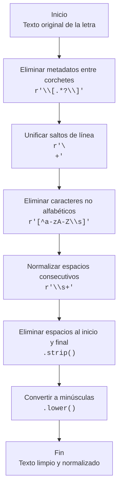
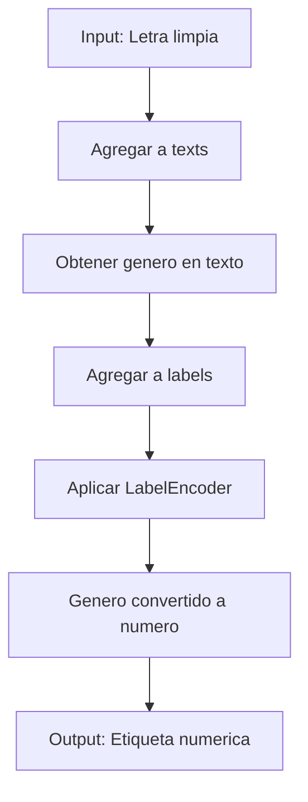
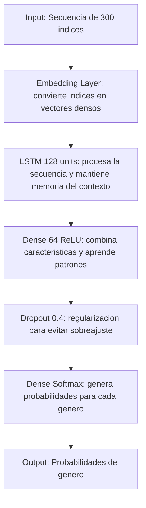
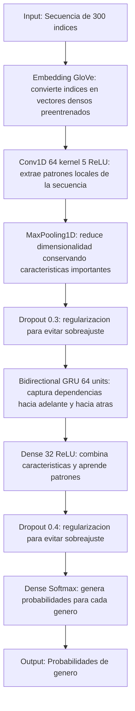
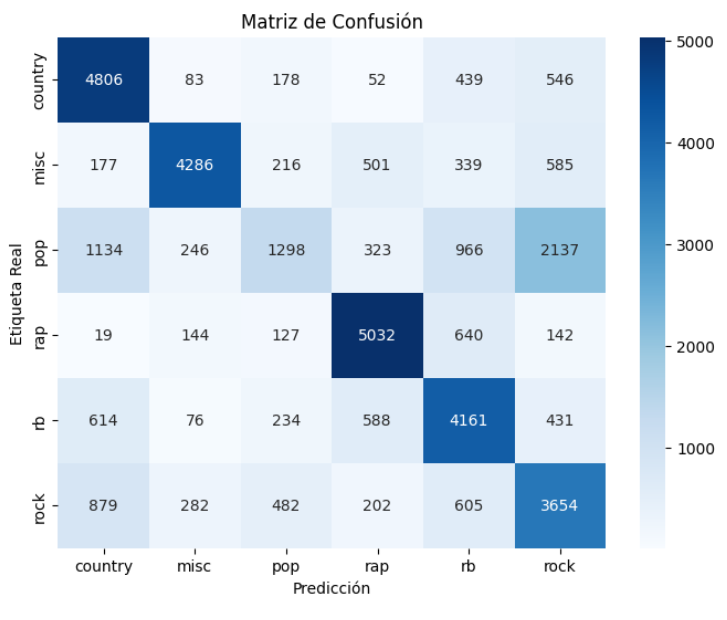

# Resumen

Se desarrollaron dos modelos de clasificación cuyo objetivo principal es categorizar letras de canciones según su género musical mediante técnicas de Procesamiento de Lenguaje Natural (NLP). El dataset original contiene aproximadamente cinco millones de registros y abarca seis géneros: country, misc, pop, rap, rb y rock.

Si bien ambos modelos logran identificar patrones lingüísticos relevantes, presentan limitaciones inherentes al uso exclusivo de texto. Las letras por sí solas no capturan todos los elementos musicales (timbre, ritmo, entonación) que definen un género. Para construir un sistema verdaderamente robusto, sería necesario incorporar el audio de las canciones y aplicar técnicas de visión o procesamiento de señales, como espectrogramas analizados con redes neuronales convolucionales (CNN).

Por restricciones computacionales, los modelos se entrenaron usando solo una fracción del dataset completo:

- Modelo 1: 500,000 registros en Google Colab.
- Modelo 2: 2,200,000 registros en Kaggle.

Estos subconjuntos permitieron entrenar modelos funcionales manteniendo un balance entre rendimiento, tiempos de ejecución y disponibilidad de recursos.

## Limitaciones Generales

Ambos modelos presentan limitaciones importantes derivadas principalmente del tamaño del dataset y de la naturaleza de los datos disponibles. La primera limitación es la falta de recursos computacionales suficientes para procesar los 5,000,000 de registros originales. Debido a ello, fue necesario reducir el tamaño del conjunto de datos a subconjuntos más manejables, lo cual disminuye la diversidad y representatividad de los ejemplos utilizados durante el entrenamiento.

Otra limitación significativa es que el dataset contiene únicamente las letras de las canciones y no incluye información relacionada con el audio. Esto restringe la capacidad del modelo para capturar características musicales complejas como ritmo, tempo, entonación o patrones sonoros propios de cada género. Para mejorar la robustez del sistema y lograr una clasificación más completa, sería necesario integrar tanto el análisis textual como el análisis del audio original, idealmente mediante modelos especializados como redes neuronales convolucionales (CNN) o arquitecturas híbridas multimodales.

Finalmente, la ausencia de metadatos adicionales como estructura musical, producción, instrumentos o información contextual del artista limita el alcance del modelo, que solo puede aprender patrones lingüísticos y no características propias del estilo musical.

## Sesgos del Dataset

El modelo presenta sesgos derivados de la composición del dataset. En primer lugar, el conjunto de datos solo contempla seis géneros musicales, lo cual reduce la diversidad real del panorama musical. Esta limitación puede generar un sesgo significativo, ya que muchos géneros, subgéneros y fusiones musicales no están representados. Como consecuencia, el modelo aprende a distinguir únicamente entre un conjunto reducido de estilos, lo que limita su capacidad para generalizar si se le proporcionan letras pertenecientes a géneros no incluidos.

No obstante, la reducción a seis categorías también tiene un efecto positivo: disminuye la superposición entre clases y facilita el aprendizaje de patrones específicos, reduciendo la confusión y mejorando la estabilidad del entrenamiento. Aun así, es importante reconocer que esta simplificación puede introducir un sesgo implícito, ya que el modelo podría clasificar cualquier letra en uno de los géneros disponibles, incluso si no corresponde a ninguno.

Además, la distribución de los datos entre los géneros puede no ser equilibrada, lo que podría provocar que el modelo favorezca los géneros con mayor cantidad de ejemplos. Esto representa un riesgo de sobreajuste hacia clases dominantes y una disminución del rendimiento en géneros minoritarios.

## Primer Modelo

El primer modelo implementa una red neuronal recurrente LSTM (Long Short-Term Memory), diseñada para aprender patrones secuenciales presentes en las letras de las canciones.

El preprocesamiento incluye la limpieza del texto mediante expresiones regulares (regex), la tokenización de palabras con un vocabulario de 15,000 términos, la conversión a secuencias numéricas y la aplicación de padding para estandarizar la longitud a 300 tokens.

Se emplea una capa de embedding de 128 dimensiones que aprende representaciones vectoriales de las palabras durante el entrenamiento. La arquitectura LSTM, también con 128 unidades y dropout, permite capturar dependencias temporales en las letras, identificando características lingüísticas y temáticas distintivas de cada género musical.

## Segundo Modelo

El segundo modelo utiliza GloVe (Global Vectors for Word Representation), un algoritmo no supervisado que genera representaciones vectoriales de palabras a partir de grandes corpus de texto. Estas representaciones capturan relaciones semánticas y sintácticas entre las palabras, revelando estructuras lineales en el espacio vectorial.

El modelo combina una CNN y una GRU bidireccional para la clasificación de letras de canciones. Emplea los vectores preentrenados de GloVe como embeddings iniciales, lo que permite que el modelo aprenda con mayor rapidez el significado y contexto de las palabras.

La capa convolucional extrae patrones locales y combinaciones de palabras relevantes, mientras que la GRU bidireccional captura dependencias contextuales en ambas direcciones de la secuencia.

El preprocesamiento incluye la limpieza de las letras mediante expresiones regulares (regex), la tokenización de 20,000 palabras, la conversión a secuencias numéricas y la aplicación de padding para limitar las letras a un máximo de 300 tokens.

# Extracción de Datos

El dataset utilizado contiene información recopilada durante 2022 desde la plataforma Genius, un sitio colaborativo donde los usuarios pueden subir y transcribir letras de canciones, poemas e incluso fragmentos de libros aunque su uso principal está enfocado en la música.

Este conjunto de datos incluye aproximadamente 5 millones de canciones, junto con sus respectivas letras.
Las letras provienen directamente del formato nativo de Genius, el cual requiere un preprocesamiento cuidadoso antes de ser analizado o utilizado para entrenar modelos de Deep Learning.

En particular:

- Las letras suelen incluir metadatos entre corchetes, como [Verse 1], [Chorus] o [Produced by ...], que no forman parte del contenido lírico y deben eliminarse o tratarse.
- La estructura original del texto mantiene los saltos de línea y secciones tal como aparecen en la transcripción, lo cual puede generar dificultades al leer los datos o al pasarlos a modelos que esperan texto plano.
- Además, otras columnas del dataset (como los campos de features o descripciones adicionales) también requieren limpieza y normalización antes de ser utilizadas en el pipeline de procesamiento.

## Tamaño del Dataset

El dataset descargado ocupa 8650.20 MB (aproximadamente 8.44 GB) en disco. Aunque en Kaggle se reporta un tamaño de 9.07 GB, esta diferencia puede deberse a la compresión de archivos o a variaciones en cómo se calcula el tamaño. Con este volumen de datos, se cuenta con información suficiente para entrenar un modelo de deep learning. En este proyecto, se implementará una red neuronal recurrente basada en GRU (Gated Recurrent Unit) para realizar clasificación de textos.

## Limitación de los Registros

Para limitar el tamaño de los datos y optimizar el uso de recursos computacionales durante el entrenamiento y la limpieza del dataset, se seleccionaron únicamente 500,000 filas para el primero modelo 2,200,000 filas para el segundo modelo mediante el parámetro nrows.

Esta reducción permite:

- Acelerar el proceso de carga, preprocesamiento y entrenamiento.
- Disminuir el uso de memoria RAM de la GPU o del entorno y tiempo de cómputo.
- Hacer viable el entrenamiento en Kaggle o Google Colab en un tiempo considerable.

Sin embargo, esta decisión implica una disminución potencial en el rendimiento del modelo, ya que al disponer de menos ejemplos:

- Se reduce la diversidad y representatividad de los datos.
- El modelo puede aprender menos patrones o generalizar peor frente a datos nuevos.

## Selección de features

El dataset original contiene diversas columnas con información sobre las canciones, entre ellas:

`title, tag, artist, year, views, features, lyrics, id, language_cld3, language_ft y language.`

Se determinó que para los fines del proyecto (entrenar un modelo que clasifique las letras según su género musical) no todas las variables son necesarias.

El análisis de frecuencia de géneros muestra que rap es el género predominante en el dataset, seguido por misc, rock, pop, country y finalmente R&B, que presenta la menor representación.

La mayoría de las canciones disponibles en el dataset están en inglés en ambas segmentaciones (Modelo 1 y Modelo 2)

# Transformación de datos

## Filtrado por idioma

Se seleccionan únicamente las canciones cuyo idioma es inglés (language == 'en'), con el propósito de entrenar el modelo con un conjunto de datos lingüísticamente homogéneo y evitar sesgos debidos a diferencias idiomáticas.

El ranking de los géneros más populares en las canciones se mantiene igual al filtrar el lenguaje.

## Normalizar el tamaño de los datos

Con el fin de evitar el sobreajuste (overfitting) observado en el modelo anterior, se identificará el género musical con menor cantidad de datos y se usará como referencia para balancear el tamaño de las demás clases. De esta manera, se entrena el modelo con un conjunto equilibrado, reduciendo el sesgo hacia géneros con más muestras y mejorando su capacidad de generalización.

## Selección de columnas relevantes

Dado que el obetivo es clasificar las letras (lyrics) según su género musical (tag), se conservan únicamente estas dos columnas en el dataset limpio:

- tag: género musical (etiqueta objetivo).
- lyrics: texto de la canción (característica principal para el modelo).

## Limpieza de las letras

Se limpian las letras de las canciones aplicando regex para su transformación, esto nos ayuda ya que los modelos NLP funcionan mejor con texto limpio y normalizado, lo que reduce el ruido y el tamaño del vocabulario:

1. Elimina texto que se encuentra entre corchetes como [Chorus], [Verse 1]... que son metadatos dentro de la letra.

```
r'\[.*?\]'
```

2. Remplaza los saltos de linea por un espacio simple para convertir todo a una sola línea.

```
r'\n+'
```

3. Elimina todos los carácteres, excepto letras (a-z, A-Z) y espacios. Esto ayuda a remover números, signos de puntuación y carácteres especiales.

```
r'[^a-zA-Z\s]'
```

4. Compacta los espacios consecutivos en uno solo.

```
r'\s+'
```

5. Elimina los espacos en blanco al inicio y al final de cada letra.

```
.strip()
```

6. Convierte todo a minúsculas para la normalización de las palabras y tratar a todas las palabras por igual.

```
.lower()
```



## Preparar datos para el modelo

1. Variable texts: Convierte la columna de 'lyrics_clean' a una lista de strings. Cada elemento es la letra completa de la canción.
2. Variable labels: Extrae los géneros musicales (ej: "rap", "pop", "rock") como lista.
3. Función LabelEncoder(): Convierte las etiquetas de texto a números, esto es importante porque las redes neuronales solo procesan números.



```python
texts = df_trimmed['lyrics_clean'].astype(str).tolist()
labels = df_trimmed['tag'].astype(str).tolist()

le = LabelEncoder()
y = le.fit_transform(labels)
```

# Modelado

## Hiperparámetros

**MAX_WORDS** = 20,000 o 15,000: El vocabulario se limitará a 20,000 o 15,000 más frecuentes de las letras y las palabras menos comunes se van a marcar como desconocidas

¿Por qué se eligieron solo 20,000 palabras? Para obtener un balance entre un vocabulario amplio.

**MAX_LEN** = 350 o 300: Cada letra solo va a contener 350 o 300 palabras, si la letra tiene menos de 350 o 300 palabras, entonces se rellena con ceros hasta 350 0 300.

**EMBED_DIM** = 200: Es la dimensión del embedding que empata con la versión que se va a utilizar de Glove, significa que cada palabra se convierte en un vector de 200 valores reales [0.12, -0.45, 0.98, ...] con 200 posiciones.

```python
MAX_WORDS = 20000 | 15000 # Dependiendo del modelo
MAX_LEN = 350 | 300
EMBED_DIM = 200
```

## Cargar glove embeddings en el Modelo 2

Esta función convierte los vectores preentrenados de GloVe en una matriz de embeddings que el modelo puede usar como pesos iniciales en la capa embedding.
Así, cada palabra del vocabulario se asocia con un vector semántico aprendido previamente (en lugar de entrenarlo desde cero).

1. Carga los vectores de Glove, abre el archivo .txt que se va a utilizar. Cada línea del .txt contiene una palabra seguida de sus valores vectoriales.
2. Se guarda en un diccionario 'embedding_index' la palabra y los pesos asociados.
3. Se inicializa una matriz vacía(inicialmente llena de ceros) de embeddings con el tamaño del vocabulario 'num_words' por la dimensión de los embeddings.
4. Recorre todas las palabras del vocabulario que usó el tokenizer y si la palabra se encuentra en Glove, copia su vector en la posición correspondiente de la embedding_matrix.
5. Si no existen palabras similares en Glove, se deja el vector en ceros.
6. Finalmente se devuelve la matriz 'embedding_matrix'

```python

def load_glove_embeddings(glove_file, word_index, embedding_dim):
    embeddings_index = {}
    with open(glove_file, 'r', encoding='utf-8') as f:
        for line in f:
            values = line.split()
            word = values[0]
            coefs = np.asarray(values[1:], dtype='float32')
            embeddings_index[word] = coefs

    num_words = min(MAX_WORDS, len(word_index) + 1)
    embedding_matrix = np.zeros((num_words, embedding_dim))

    for word, i in word_index.items():
        if i >= MAX_WORDS:
            continue
        embedding_vector = embeddings_index.get(word)
        if embedding_vector is not None:
            embedding_matrix[i] = embedding_vector

    return embedding_matrix
```

## Dividir datos

Para evaluar de forma justa el rendimiento del modelo, el conjunto de datos se divide en tres subconjuntos:

### Modelo 1

- 80% para entrenamiento (X_train, y_train): El modelo aprende de estos
- 20% para prueba (X_test, y_test): Se usan para evaluar el desempeño real del modelo en datos que nunca vio

### Modelo 2

- **Entrenamiento** (70%): usado para ajustar los parámetros del modelo.
- **Validación** (15%): permite ajustar hiperparámetros y prevenir sobreajuste durante el entrenamiento.
- **Prueba** (15%): se reserva completamente para evaluar el desempeño final en datos nunca vistos.

random_state=42: Semilla aleatoria que sirve para reproducibilidad de la ejecución.

# Arquitectura por capa

## Modelo 1

Embedding(...): Capa de entrada

- Entrada: Secuencias de números enteros (índices de palabras)
- Salida: Vectores de 128 dimensiones para cada palabra
- input_dim=15000: Vocabulario de 15,000 palabras
- output_dim=128: Cada palabra se convierte en un vector de 128 números
- input_length=300: Cada secuencia tiene 300 palabras
- Función: Convierte índices a vectores densos. Similar a una "tabla de búsqueda" entrenable

#### LSTM(128, ...): Capa recurrente (el "cerebro" del modelo)

- 128 unidades: Tamaño del estado oculto (memoria interna)
- return_sequences=False: Solo devuelve la salida del ÚLTIMO paso de tiempo (no todas las palabras)
- dropout=0.3: Apaga aleatoriamente 30% de las neuronas durante entrenamiento para evitar overfitting
- recurrent_dropout=0.3: Dropout especial para conexiones recurrentes
- Función: Procesa la secuencia palabra por palabra, manteniendo "memoria" del contexto. Captura patrones como "palabras que suelen aparecer juntas en rock" vs "en pop"

#### Dense(64, activation='relu'): Capa densa completamente conectada

- 64 neuronas: Reduce dimensionalidad y aprende combinaciones de características
- relu: Función de activación (deja pasar valores positivos, anula negativos)
- Función: Aprende representaciones de alto nivel a partir de la salida del LSTM

#### Dropout(0.4): Regularización más agresiva

- Apaga 40% de neuronas aleatoriamente
- Función: Previene que el modelo dependa demasiado de características específicas

#### Dense(len(le.classes\_), activation='softmax'): Capa de salida

- Neuronas: Una por cada género (ej: 10 géneros = 10 neuronas)
- softmax: Convierte salidas en probabilidades que suman 1
- Ejemplo de salida: [0.05, 0.70, 0.10, 0.05, 0.10] → 70% probabilidad de ser género #2
- Función: Clasificación final



## Modelo 2

#### Embedding(...): Capa de entrada con vectores GloVe

Traduce los índices de palabras a representaciones semánticas ricas, aprovechando el conocimiento previo de GloVe sobre relaciones entre palabras.

- Entrada: Secuencias de números enteros (índices de palabras).
- Salida: Vectores densos de EMBED_DIM dimensiones para cada palabra.
  Parámetros clave:
- input_dim=MAX_WORDS: tamaño del vocabulario (15,000 palabras).
- weights=[embedding_matrix]: inicializa la capa con embeddings preentrenados GloVe.
- trainable=True: permite ajustar ligeramente los vectores durante el entrenamiento.
- input_length=MAX_LEN: longitud fija de cada secuencia (300 tokens).

#### Conv1D(64, 5, activation='relu'): Capa convolucional 1D

Extrae características locales y estructuras comunes, como frases o expresiones típicas de un género musical.

- 64 filtros: detectan patrones locales de palabras (n-gramas) dentro de las secuencias.
- Kernel size = 5: ventana deslizante que capta combinaciones de hasta 5 palabras consecutivas.
- ReLU: activa solo valores positivos, aportando no linealidad.

#### MaxPooling1D(pool_size=2): Capa de reducción

- Reduce la dimensionalidad al conservar solo las características más relevantes de cada filtro.
- Hace que la red sea más eficiente y resistente al ruido en el texto.

#### Dropout(0.3): Regularización

- 30 % de neuronas desconectadas aleatoriamente.
- Evita overfitting, ayudando a que el modelo generalice mejor.

#### Bidirectional(GRU(64, dropout=0.3, recurrent_dropout=0.3)): Capa recurrente bidireccional

Captura el contexto global de la letra, entendiendo cómo una palabra depende de las anteriores y posteriores.

- 64 unidades GRU: cada una procesa dependencias a largo plazo en la secuencia.
- Bidireccional: lee el texto tanto de izquierda a derecha como de derecha a izquierda.
- Dropout y recurrent_dropout = 0.3: previenen sobreajuste tanto en conexiones estándar como recurrentes.

#### Dense(32, activation='relu'): Capa totalmente conectada

Aprende combinaciones de características de alto nivel que representan el estilo o tema de la letra.

- 32 neuronas: condensan la información aprendida por la GRU.
- ReLU: mantiene la no linealidad.

#### Dropout(0.4): Regularización adicional

- 40 % de neuronas desconectadas.
- Refuerza la capacidad de generalización del modelo antes de la clasificación final.

#### Dense(num_classes, activation='softmax'): Capa de salida

- Realiza la clasificación final según la probabilidad de pertenencia a cada género.
- Neuronas: una por cada clase (género musical).
- Ejemplo de salida: [0.05, 0.70, 0.10, 0.05, 0.10] → 70% probabilidad de ser género #2
- Softmax: transforma los valores en probabilidades que suman 1.



# Resultados

## Modelo 1

En el primer modelo se observa que no logró generalizar adecuadamente. La matriz de confusión muestra que las clasificaciones por género no son correctas, a pesar de que el modelo reporta un test accuracy de 0.76. Este valor resulta engañoso cuando se analiza cómo realmente está realizando las predicciones.

La causa principal de este comportamiento fue una mala división de los datos. La mayoría de las letras pertenecen al género rap, por lo que el modelo terminó sesgado hacia esta clase, sin aprender patrones representativos de los demás géneros. En consecuencia, el accuracy parece elevado únicamente porque el conjunto está desbalanceado: al haber más ejemplos de un mismo género, el modelo acierta con mayor frecuencia sin necesariamente aprender.

Además de la mala clasificación, el tiempo de entrenamiento fue excesivamente largo: cada epoch tomó alrededor de una hora. Esto indica que tanto la arquitectura del modelo como el método de embedding requieren optimización para reducir el tiempo de cómputo.

Debido a los largos tiempos de ejecución, se utilizó el autoguardado del mejor modelo para continuar el entrenamiento posteriormente. Esto impidió conservar el historial completo de los epochs y, como resultado, no fue posible generar las gráficas de loss y accuracy del proceso de entrenamiento.

| **Clase**        | **Precision** | **Recall** | **F1-score** | **Support** |
| ---------------- | ------------: | ---------: | -----------: | ----------: |
| country          |          0.50 |       0.48 |         0.49 |       2,844 |
| misc             |          0.88 |       0.88 |         0.88 |      15,472 |
| pop              |          0.42 |       0.19 |         0.26 |       9,315 |
| rap              |          0.91 |       0.94 |         0.92 |      35,821 |
| rb               |          0.36 |       0.03 |         0.05 |       1,899 |
| rock             |          0.54 |       0.75 |         0.63 |      14,147 |
| **accuracy**     |             — |          — |   **0.7691** |      79,498 |
| **macro avg**    |          0.60 |       0.55 |         0.54 |      79,498 |
| **weighted avg** |          0.75 |       0.77 |         0.75 |      79,498 |

El modelo muestra un test accuracy de 0.76, pero este valor es altamente engañoso debido al desbalance extremo del dataset. La clase rap domina el conjunto de entrenamiento y prueba, por lo que el modelo aprende a predecir ese género con mucha frecuencia. Esto explica por qué:

- rap tiene alta precision, recall y f1 (0.92)
- clases minoritarias como rb y pop tienen valores muy bajos, especialmente recall
- el macro F1 = 0.54, indicando rendimiento deficiente cuando todas las clases son tratadas por igual

La aparente “buena” exactitud no refleja una verdadera capacidad de generalización: el modelo está sesgado hacia la clase mayoritaria y no aprende representaciones robustas para las demás.

![](data:image/png;base64,iVBORw0KGgoAAAANSUhEUgAAApoAAAIjCAYAAACjybtCAAAAOnRFWHRTb2Z0d2FyZQBNYXRwbG90bGliIHZlcnNpb24zLjEwLjAsIGh0dHBzOi8vbWF0cGxvdGxpYi5vcmcvlHJYcgAAAAlwSFlzAAAPYQAAD2EBqD+naQAArlRJREFUeJzs3XVYVNsaBvB36C4BAUHCQDGwARWTIyp2t2IrJiYWNnZ3d3cr9lGxUEywDopFGIB0zf2D4xxHUMHLZkbm/d1n7uOsvWbNt/cZho9vr722SCwWi0FERERElMeUZB0AERERERVMTDSJiIiISBBMNImIiIhIEEw0iYiIiEgQTDSJiIiISBBMNImIiIhIEEw0iYiIiEgQTDSJiIiISBBMNImI/mAHDhzAvHnzkJ6eLutQiIiyYKJJRJg8eTJEIpGg7yESiTB58mRB3yO/zZ07F3Z2dlBWVkaFChXyfPwePXrAxsbmh9uvXbuGzp07w8HBAcrKynn+/kRE/y8mmkT5aNOmTRCJRBCJRLhy5UqW7WKxGFZWVhCJRGjSpMlvvcfMmTNx6NCh/zPSP0N6ejo2btyIOnXqwMjICOrq6rCxsYGnpydu374t6HufOXMGo0ePRo0aNbBx40bMnDlT0Pf73sePH9GhQwcsWbIEjRs3ztf3JiLKKSaaRDKgoaGBHTt2ZGm/dOkS3rx5A3V19d8e+3cSzQkTJiAxMfG331MWEhMT0aRJE/Ts2RNisRjjxo3DypUr0a1bNwQEBKBatWp48+aNYO9//vx5KCkpYf369ejWrZsgyd7atWvx5MmTbLfdvXsX06dPR58+ffL8fYmI8oqKrAMgUkSNGzfG3r17sWTJEqio/PdjuGPHDlSuXBkfPnzIlzji4+Ohra0NFRUVqTj+BKNGjcKpU6ewcOFCDBs2TGqbr68vFi5cKOj7R0ZGQlNTE2pqaoK9h6qq6g+3ubm5Cfa+RER5hRVNIhno2LEjPn78CH9/f0lbSkoK9u3bh06dOmX7mnnz5qF69eooVKgQNDU1UblyZezbt0+qj0gkQnx8PDZv3iw5Rd+jRw8A/83DfPz4MTp16gRDQ0PUrFlTattXPXr0kLz++8ev5lkmJydj+PDhMDExga6uLpo1a/bDyuLbt2/Rs2dPFC5cGOrq6ihTpgw2bNjwq8OHN2/eYPXq1fjrr7+yJJkAoKysjJEjR8LS0lLSdvfuXTRq1Ah6enrQ0dFB/fr1cf36danXfZ3acPXqVXh7e8PExATa2tpo2bIloqKiJP1EIhE2btyI+Ph4yXHZtGkTXr58Kfn3974/dl++fMGwYcNgY2MDdXV1mJqa4q+//sKdO3ckfbKboxkfH48RI0bAysoK6urqsLe3x7x58yAWi7O836BBg3Do0CGULVtWcnxPnTr1y+NLRJRX/qwSBlEBYWNjAxcXF+zcuRONGjUCAJw8eRIxMTGSeXffW7x4MZo1a4bOnTsjJSUFu3btQtu2bXHs2DF4eHgAALZu3YrevXujWrVq6Nu3LwCgWLFiUuO0bdsWJUqUwMyZM7MkJ1/169cvS8Xs1KlT2L59O0xNTX+6b71798a2bdvQqVMnVK9eHefPn5fE962IiAg4OztLEiITExOcPHkSvXr1QmxsbLYJ5FcnT55EWloaunbt+tNYvnr06BFcXV2hp6eH0aNHQ1VVFatXr0adOnVw6dIlODk5SfUfPHgwDA0N4evri5cvX2LRokUYNGgQdu/eDSDzOK9ZswY3b97EunXrAADVq1fPUSxf9e/fH/v27cOgQYPg4OCAjx8/4sqVKwgODkalSpWyfY1YLEazZs1w4cIF9OrVCxUqVMDp06cxatQovH37NksV98qVKzhw4AAGDhwIXV1dLFmyBK1bt0ZYWBgKFSqUq3iJiH6LmIjyzcaNG8UAxLdu3RIvW7ZMrKurK05ISBCLxWJx27ZtxXXr1hWLxWKxtbW12MPDQ+q1X/t9lZKSIi5btqy4Xr16Uu3a2tri7t27Z3lvX19fMQBxx44df7jtR549eybW19cX//XXX+K0tLQf9gsKChIDEA8cOFCqvVOnTmIAYl9fX0lbr169xObm5uIPHz5I9e3QoYNYX18/y/5+a/jw4WIA4rt37/6wz7datGghVlNTE7948ULS9u7dO7Gurq64Vq1akrav/33c3NzEGRkZUu+nrKwsjo6OlrR1795drK2tLfU+oaGhYgDijRs3Zonh+/3X19cXe3l5/TTu7t27i62trSXPDx06JAYgnj59ulS/Nm3aiEUikfj58+dS76empibVdu/ePTEA8dKlS3/6vkREeYWnzolkpF27dkhMTMSxY8fw5csXHDt27IenzQFAU1NT8u/Pnz8jJiYGrq6uUqdac6J///656h8fH4+WLVvC0NAQO3fu/OkyOidOnAAADBkyRKr9++qkWCzG/v370bRpU4jFYnz48EHycHd3R0xMzE/3KzY2FgCgq6v7y/jT09Nx5swZtGjRAnZ2dpJ2c3NzdOrUCVeuXJGM91Xfvn2lphK4uroiPT0dr169+uX75ZSBgQFu3LiBd+/e5fg1J06cgLKycpbjO2LECIjFYpw8eVKq3c3NTaqiXb58eejp6eGff/75/4InIsohnjonkhETExO4ublhx44dSEhIQHp6Otq0afPD/seOHcP06dMRFBSE5ORkSXtu17+0tbXNVf8+ffrgxYsXuHbt2i9Pt7569QpKSkpZTtfb29tLPY+KikJ0dDTWrFmDNWvWZDtWZGTkD99HT08PQOY8x1+JiopCQkJClhgAoHTp0sjIyMDr169RpkwZSXvRokWl+hkaGgLITPDzypw5c9C9e3dYWVmhcuXKaNy4Mbp16yaVDH/v1atXsLCwyJJgly5dWrL9W9/vB5C5L3m5H0REP8NEk0iGOnXqhD59+iA8PByNGjWCgYFBtv3+/vtvNGvWDLVq1cKKFStgbm4OVVVVbNy4Mdtlkn7m28roryxevBg7d+7Etm3b8nRB8oyMDABAly5d0L1792z7lC9f/oevL1WqFADgwYMHgiyU/qOqrfgHc1q/+lHSn91de9q1awdXV1ccPHgQZ86cwdy5czF79mwcOHBAMm/3//W7+0FElFeYaBLJUMuWLdGvXz9cv35dcqFJdvbv3w8NDQ2cPn1aao3NjRs3ZumbV3f4+fvvvzFy5EgMGzYMnTt3ztFrrK2tkZGRgRcvXkhVEL9fC/LrFenp6em/tUxPo0aNoKysjG3btv3ygiATExNoaWllux5lSEgIlJSUYGVllesYsvO18hkdHS3V/qNT7ubm5hg4cCAGDhyIyMhIVKpUCTNmzPhhomltbY2zZ8/iy5cvUlXNkJAQyXYiInnCOZpEMqSjo4OVK1di8uTJaNq06Q/7KSsrQyQSSVXGXr58me3C7Nra2lkSndx6//492rVrh5o1a2Lu3Lk5ft3XBOn7q+YXLVok9VxZWRmtW7fG/v378fDhwyzjfLuUUHasrKzQp08fnDlzBkuXLs2yPSMjA/Pnz8ebN2+grKyMBg0a4PDhw3j58qWkT0REBHbs2IGaNWtKTsX/v/T09GBsbIzLly9Lta9YsULqeXp6OmJiYqTaTE1NYWFhITUt4nuNGzdGeno6li1bJtW+cOFCiESiPKuEEhHlFVY0iWTsR6eOv+Xh4YEFCxagYcOG6NSpEyIjI7F8+XIUL14c9+/fl+pbuXJlnD17FgsWLICFhQVsbW2zLN/zK0OGDEFUVBRGjx6NXbt2SW0rX778D09rV6hQAR07dsSKFSsQExOD6tWr49y5c3j+/HmWvrNmzcKFCxfg5OSEPn36wMHBAZ8+fcKdO3dw9uxZfPr06acxzp8/Hy9evMCQIUNw4MABNGnSBIaGhggLC8PevXsREhKCDh06AACmT58Of39/1KxZEwMHDoSKigpWr16N5ORkzJkzJ1fH5ld69+6NWbNmoXfv3qhSpQouX76Mp0+fSvX58uULLC0t0aZNGzg6OkJHRwdnz57FrVu3MH/+/B+O3bRpU9StWxfjx4/Hy5cv4ejoiDNnzuDw4cMYNmxYlrmxREQyJ9Nr3okUzLfLG/1MdssbrV+/XlyiRAmxurq6uFSpUuKNGzdmuyxRSEiIuFatWmJNTU0xAMlSR1/7RkVFZXm/78epXbu2GEC2j2+X6MlOYmKieMiQIeJChQqJtbW1xU2bNhW/fv0629dGRESIvby8xFZWVmJVVVWxmZmZuH79+uI1a9b89D2+SktLE69bt07s6uoq1tfXF6uqqoqtra3Fnp6eWZY+unPnjtjd3V2so6Mj1tLSEtetW1d87do1qT4/+u9z4cIFMQDxhQsXJG3ZLW8kFmcuQ9WrVy+xvr6+WFdXV9yuXTtxZGSk1P4nJyeLR40aJXZ0dBTr6uqKtbW1xY6OjuIVK1ZIjfX98kZisVj85csX8fDhw8UWFhZiVVVVcYkSJcRz586VWo5JLM5c3ii75ZOsra2zXf6KiEgIIrGYs8KJiIiIKO9xjiYRERERCYKJJhEREREJgokmEREREQmCiSYRERERCYKJJhEREREJgokmEREREQmCiSYRERERCaJA3hkoOjH9150oRzRUlWUdQoHBFWvzRh7dyp0oT6WkZcg6hAJBT0N29S/NioMEGzvx7rJfdyqgWNEkIiIiIkEUyIomERERUa6IWHsTAhNNIiIiIs7LEQTTdyIiIiISBCuaRERERDx1LggeVSIiIiISBCuaRERERJyjKQhWNImIiIhIEKxoEhEREXGOpiB4VImIiIhIEKxoEhEREXGOpiCYaBIRERHx1LkgeFSJiIiISBAyTzR9fX3x6tUrWYdBREREikwkEu6hwGSeaB4+fBjFihVD/fr1sWPHDiQnJ8s6JCIiIiLKAzJPNIOCgnDr1i2UKVMGQ4cOhZmZGQYMGIBbt27JOjQiIiJSFCIl4R4KTC72vmLFiliyZAnevXuH9evX482bN6hRowbKly+PxYsXIyYmRtYhEhEREVEuyUWi+ZVYLEZqaipSUlIgFothaGiIZcuWwcrKCrt375Z1eERERFRQcY6mIOQi0QwMDMSgQYNgbm6O4cOHo2LFiggODsalS5fw7NkzzJgxA0OGDJF1mERERESUCzJfR7NcuXIICQlBgwYNsH79ejRt2hTKyspSfTp27IihQ4fKKEIiIiIq8BR8LqVQZJ5otmvXDj179kSRIkV+2MfY2BgZGRn5GBUREREpFAU/xS0Umabvqamp2LRpE2JjY2UZBhEREREJQKYVTVVVVSQlJckyBCIiIiKeOheIzI+ql5cXZs+ejbS0NFmHQkRERER5SOZzNG/duoVz587hzJkzKFeuHLS1taW2HzhwQEaRERERkcJgRVMQMk80DQwM0Lp1a1mHQURERER5TOaJ5saNG2UdAhERESk6JV51LgSZ14nr1auH6OjoLO2xsbGoV69e/gdERERERHlC5hXNixcvIiUlJUt7UlIS/v77bxlERERERAqHczQFIbNE8/79+5J/P378GOHh4ZLn6enpOHXq1E8XcSciIiLKM1ywXRAySzQrVKgAkUgEkUiU7SlyTU1NLF26VAaREREREVFekFmiGRoaCrFYDDs7O9y8eRMmJiaSbWpqajA1Nc1yz3MiIiIiQfDUuSBklmhaW1sDwB99D/O7gbexbfMGhAQ/woeoKMxZsAS167lJtq9duQz+p08iIjwcqqqqKOXggP6DhqJsOUcAQOCtmxjYp0e2Y2/cthsOZctJtb0Oe4VuHVpDSUkZ567cEGy/5FFERAQWLZiLq3//jaSkRFgVtcbU6TNR5t9j5FjGPtvXDR8xCj169s7PUOVK4O1b2LxxPYIfP0RUVBQWLF6OevX/+4wmJMRj8cL5uHD+LGKio1GkiCU6du6Ktu07SvpMmzIJNwKuISoqElpaWnCsUBFDh4+ErV0xWeySXOHnUhiBt29h04b/PrcLl0h/bhXVncBb2Lrpv985cxcuRZ1vfuecP3sGB/buRkjwI8TExGDb7gOwL1Vaaox+vbrhzu1bUm2t2rSHz8TJAICnT0KwecNaBN29g5jozzC3KIJWbdujY+dugu8fFUwyvxgIAJ49e4YLFy4gMjIyS+I5adIkGUX1a4mJCShR0h5NW7TCGO8hWbYXtbbByLHjUcTSCslJSdi5fQuGDOiD/UdOwdDICOUrVMCJs5ekXrN6+VLcunkdpcuUlWpPS03FxLGj4FixMh7cCxJyt+RObEwMenTpiCrVnLB81VoYGhki7NUr6OnpS/qcu3hF6jVXrlzG5Inj4faXe36HK1cSExNQ0t4eLVq2hvewQVm2z5szC7duXMcMv7mwKFIEAdeuwm/6FJiYmqJO3foAgNIOZdDYoynMzM0RGxODVSuWYkDfXjh++pxCn3Xg51I4iYkJsLe3R4tWreE9NOvnVlElJiaipL09mrVohdHZ/M5JSkyEY8VKcHNviBlTfvy7s0Xrtug3cLDkuYaGpuTfIY8fwdCoEKbOnI3CZua4H3QXM6f5QllJGe06ds7bHZI3nKMpCJknmmvXrsWAAQNgbGwMMzMziL75Dy0SieQ60axesxaq16z1w+3ujZtIPR86YgyOHNyP58+eoKqTC1RV1VDI+L8pA2mpqbh88TzaduwsdRwAYNXyJbC2tUXVas4Kl2huWL8Whc3MMG2Gn6TN0tJKqo/xN1MvAODi+XOoWs0JllbS/RRNTdfaqOla+4fb7wXdRdPmLVC1mhMAoE3b9ti/dzcePrgvSTTbtG0v6V+kiCW8Bg9Du9bN8e7tW1gVLSrsDsgxfi6F86vPraKqUbMWavzkd07jps0BAO/evv3pOBoaGjA2Nsl2W7OW0jdQsbS0woP7Qbhwzr/gJ5okCJlPSJg+fTpmzJiB8PBwBAUF4e7du5LHnTt3ZB1enklNTcGh/Xugo6OLEiVLZdvn8qULiImJRpPmLaXab9+8jnP+pzHKZ2J+hCp3Ll04jzJlymLk8CGo4+qCdq1bYP/ePT/s//HDB/x9+RJatmqTj1H+mRwrVMTFC+cREREBsViMWzev49XLULhUr5lt/8SEBBw+dABFLC1hZm6Wz9HKF34u6U916sQxuNV2QftWTbFs8QIkJSb+tH/clzjo6ev/tE+BIFIS7qHAZF7R/Pz5M9q2bfvbr09OTkZycrJ0W4YK1NXV/9/Q8sSVyxcxYcwIJCUlwdjYBEtXrYOBoWG2fY8c3A8nlxooXPi/X+Ax0dGYOmkcpsyYAx0dnfwKW668efMae3bvRNfunujVtz8ePXiA2X7ToaqqimYtWmbpf+TwQWhpaaP+Xw1kEO2fZey4iZg6eSLc69eCiopK5lmEydNRuUpVqX67d23HovnzkJiYABtbW6xasxGqqmoyilo+8HNJfyL3Rk1gbm4BE1NTPHv6BMsWzcerl6GYuzD7VV7uBd2F/5mTWLR0VT5HSgWFzNPstm3b4syZM7/9ej8/P+jr60s9Fs6dlYcR/n8qV62GrbsPYO3mHXCuURPjRnvj06ePWfpFRITjRsDVLKctZk6dBPdGTVCxcpX8ClnuZGSIUdqhDIYM80bp0g5o0649WrVph717dmXb/9DB/WjcpKnc/LEhz3Zu34oH94OweNlK7Ni9HyNGjYXfjCm4HnBNql9jj2bYte8g1m/aBmtrG4weOSzLH3iKhp9L+hO1atMOLjVqoniJkmjk0RSTp8/CxfNn8eZ1WJa+z589xchhXujTbyCcq9eQQbT5TCQS7qHAZF7RLF68OCZOnIjr16+jXLlyUFVVldo+ZEjWCc/f8vHxgbe3t1RbYobMd0tCU1MLVkWtYVXUGuXKO6J104Y4cnA/evTqK9Xv2OGD0Nc3QK3adaXab9+8gb8vXcD2LZn3hBeLxcjIyED1yuUwduJkNGshnZgWRCYmJrArJn2Fs52dHc76n87S907gbbwMDcWceYvyKbo/V1JSEpYuXogFi5ehVu06AICS9qXwJCQYWzath7NLdUlfXV1d6OrqwtraBuUdHeFavRrOn/NHo+/mISsSfi6pIChbrjwA4HVYGCyt/ptz/c+L5/Dq2xMtW7dDr74DZBVe/lLwU9xCkXlGtmbNGujo6ODSpUu4dEn6CmyRSPTLRFNdXT1LhSAjMT3P48wrYrEYqd/dclMsFuPY4YNo1LQZVL5LtNdt2SF1Jf7lC+ewZdN6rNu8AyampvkSs6xVqFgJL0NDpdpevXwJC4usd446uH8fHMqUgX2p7OfB0n/S0tKQlpYKJSXpv7aVlJWRkSH+4evE4sz/y+7WsYqEn0sqCJ4+CQEgfeHai+fPMLCPJzyaNcfAwcNkFBkVFDJPNEO/+6L+kyQkxONN2H+nG969fYunIcHQ09eHvoEBNq5dDdc69WBsbIzo6Gjs270DUZERqP/d0ia3b17Hu7dv0Lxl1osEvl+rMPjRQyiJlFCseAlhdkoOdenWHd27dMS6NavQwL0RHj64j3379mDS5KlS/eLi4nDmzCmMGDVGRpHKn4SEeIR98xl9+/YNQkKCoa+vD3NzC1SuUg0L58+FuroGLCwscPv2LRw7cggjRo0FALx5/RqnT52AS/UaMDQyQkR4ODauXwN1dQ24KvhVwfxcCich/rvP7Zs3CAn+93NrYSHDyGQrISEer6V+57zBk39/ns3MLRATE43w9+/xISoSAPDqZebv10LGxjA2NsGb12E4deIYarjWhr6+AZ49e4KFc2ehYuUqKFEyc83X58+eYmAfTzhXr4FOXXvgw4coAICykjIMjYzyeY/zmYKf4haKSCwW/7h08YeKzqeK5o8WXPdo2gJjJvhiks8oPHpwH9HRn6FvYIDSZcqiZ+/+WRZinzh2FMLfv8Pazdt/+Z7HDh/Ewrmz8m3Bdg1V+Vgn8dLFC1iyaAHCXr1EEUtLdO3midZt20n12bdnN+bOnomzF69AV1dXRpH+mCx+0m7dvIE+PbMutNy0eUtMmzELHz5EYcmiBQi4dgWxMTEwt7BA6zbt0aVbD4hEIkRGRmCK7wQEP3qE2NhYFCpUCJWqVEG//l6wsbXL/x2CfP0uKAifS3l06+YN9PbM+rlt1rwlps2Unzn430pJE/7mI4G3bqJ/7+5Z2j2atcDkaX44evggpk4al2V7n/5e6DtgEMLD32PSuNH45/kzJCYmorCZGerUc0PPPgMkF5uuWbkMa1ctzzKGuYUFjpw8l/c79R09DdmdvtZstFCwsRNPDhdsbHkn80SzZ8+eP92+YcOGXI+ZX4mmIpCXRLMgKHh/0smGPCWaRF/lR6KpCGSaaDZeLNjYiSeGCja2vJP5qfPPnz9LPU9NTcXDhw8RHR2NevXqySgqIiIiIvp/yTzRPHjwYJa2jIwMDBgwAMWK8V7KRERElA94ukQQcnktv5KSEry9vbFwoXDzJYiIiIjkzcqVK1G+fHno6elBT08PLi4uOHnypGR7UlISvLy8UKhQIejo6KB169aIiIiQGiMsLAweHh7Q0tKCqakpRo0ahbS0NKk+Fy9eRKVKlaCuro7ixYtj06ZNWWJZvnw5bGxsoKGhAScnJ9y8eTPX+yOXiSYAvHjxIstBISIiIhKEnNyC0tLSErNmzUJgYCBu376NevXqoXnz5nj06BEAYPjw4Th69Cj27t2LS5cu4d27d2jVqpXk9enp6fDw8EBKSgquXbuGzZs3Y9OmTZg0aZKkT2hoKDw8PFC3bl0EBQVh2LBh6N27N06f/m8d4N27d8Pb2xu+vr64c+cOHB0d4e7ujsjIyNwdVllfDPT9YutisRjv37/H8ePH0b17dyxbtizXY/JioLzDi4HyDi8Gyhs8u0XyiBcD5Q2ZXgzUdIVgYyceHfh/vd7IyAhz585FmzZtYGJigh07dqBNm8wlEUNCQlC6dGkEBATA2dkZJ0+eRJMmTfDu3TsULlwYALBq1SqMGTMGUVFRUFNTw5gxY3D8+HE8fPhQ8h4dOnRAdHQ0Tp06BQBwcnJC1apVJXlYRkYGrKysMHjwYIwdOzbHscu8onn37l2px/379wEA8+fPx6JFi2QbHBEREdH/KTk5GbGxsVKPnNzGNz09Hbt27UJ8fDxcXFwQGBiI1NRUuLm5SfqUKlUKRYsWRUBAAAAgICAA5cqVkySZAODu7o7Y2FhJVTQgIEBqjK99vo6RkpKCwMBAqT5KSkpwc3OT9MkpmV8MdOHCBVmHQERERIpOwNMlfn5+mDJlilSbr68vJk+enG3/Bw8ewMXFBUlJSdDR0cHBgwfh4OCAoKAgqKmpwcDAQKp/4cKFER4eDgAIDw+XSjK/bv+67Wd9YmNjkZiYiM+fPyM9PT3bPiEhIbnad5knml9FRUXhyZMnAAB7e3uYfHM7LCIiIqI/lY+PT5apgt/fPvtb9vb2CAoKQkxMDPbt24fu3btnuU33n0LmiWZ8fDwGDx6MLVu2SO7praysjG7dumHp0qXQ0tKScYRERERU4OXyop3cUFdX/2li+T01NTUUL14cAFC5cmXcunULixcvRvv27ZGSkoLo6GipqmZERATMzMwAAGZmZlmuDv96Vfq3fb6/Uj0iIgJ6enrQ1NSEsrIylJWVs+3zdYyckvkcTW9vb1y6dAlHjx5FdHQ0oqOjcfjwYVy6dAkjRoyQdXhEREREMpWRkYHk5GRUrlwZqqqqOHfuv9uBPnnyBGFhYXBxcQEAuLi44MGDB1JXh/v7+0NPTw8ODg6SPt+O8bXP1zHU1NRQuXJlqT4ZGRk4d+6cpE9OybyiuX//fuzbtw916tSRtDVu3Biamppo164dVq5cKbvgiIiISDHIyZIWPj4+aNSoEYoWLYovX75gx44duHjxIk6fPg19fX306tUL3t7eMDIygp6eHgYPHgwXFxc4OzsDABo0aAAHBwd07doVc+bMQXh4OCZMmAAvLy9JVbV///5YtmwZRo8ejZ49e+L8+fPYs2cPjh8/LonD29sb3bt3R5UqVVCtWjUsWrQI8fHx8PT0zNX+yDzRTEhIyDLZFABMTU2RkJAgg4iIiIiIZCMyMhLdunXD+/fvoa+vj/Lly+P06dP466+/AAALFy6EkpISWrdujeTkZLi7u2PFiv+WZlJWVsaxY8cwYMAAuLi4QFtbG927d8fUqVMlfWxtbXH8+HEMHz4cixcvhqWlJdatWwd3d3dJn/bt2yMqKgqTJk1CeHg4KlSogFOnTmWbs/2MzNfRrF+/PgoVKoQtW7ZAQ0MDAJCYmIju3bvj06dPOHv2bK7H5DqaeYfraOYdrqOZN+Sk6EAkheto5g2ZrqPZcp1gYyce7C3Y2PJO5hXNRYsWoWHDhrC0tISjoyMA4N69e1BXV8eZM2dkHB0REREpBP4VKwiZJ5rlypXDs2fPsH37dsnaTB07dkTnzp2hqakp4+iIiIiI6HfJPNH08/ND4cKF0adPH6n2DRs2ICoqCmPGjJFRZERERKQoRKxoCkLmyxutXr0apUqVytJepkwZrFq1SgYREREREVFekHlFMzw8HObm5lnaTUxM8P79exlERERERIqGFU1hyLyiaWVlhatXr2Zpv3r1KiwsLGQQERERERHlBZlXNPv06YNhw4YhNTUV9erVAwCcO3cOo0eP5p2BiIiIKH+woCkImSeao0aNwsePHzFw4ECkpKQAADQ0NDBmzBj4+PjIODoiIiIi+l0yX7D9q7i4OAQHB0NTUxMlSpTI1c3nv8cF2/MOF2zPO/Lxk/bn4zQqkkdcsD1vyHLBdp12mwQbO25PD8HGlncyr2h+paOjg6pVq8o6DCIiIlJAvBhIGDK/GIiIiIiICia5qWgSERERyQormsJgRZOIiIiIBMGKJhERESk8VjSFwYomEREREQmCFU0iIiIiFjQFwYomEREREQmCFU0iIiJSeJyjKQxWNImIiIhIEKxoEhERkcJjRVMYBTLR5P25887aG6GyDqHA6ONkK+sQCoTUdN5TOq+oKvOkVl5hjvLnY6IpDH7LEBEREZEgCmRFk4iIiCg3WNEUBiuaRERERCQIVjSJiIiIWNAUBCuaRERERCQIVjSJiIhI4XGOpjBY0SQiIiIiQbCiSURERAqPFU1hMNEkIiIihcdEUxg8dU5EREREgmBFk4iIiIgFTUGwoklEREREgmBFk4iIiBQe52gKgxVNIiIiIhIEK5pERESk8FjRFAYrmkREREQkCFY0iYiISOGxoikMJppERESk8JhoCoOnzomIiIhIEKxoEhEREbGgKQhWNImIiIhIEKxoEhERkcLjHE1hsKJJRERERIJgRZOIiIgUHiuawmBFk4iIiIgEIRcVzdDQUKSlpaFEiRJS7c+ePYOqqipsbGxkExgREREpBFY0hSEXFc0ePXrg2rVrWdpv3LiBHj165H9AREREpFhEAj4UmFwkmnfv3kWNGjWytDs7OyMoKCj/AyIiIiKi/5tcnDoXiUT48uVLlvaYmBikp6fLICIiIiJSJDx1Lgy5qGjWqlULfn5+Uklleno6/Pz8ULNmTRlGRkRERES/Sy4qmrNnz0atWrVgb28PV1dXAMDff/+N2NhYnD9/XsbRERERUUHHiqYw5KKi6eDggPv376Ndu3aIjIzEly9f0K1bN4SEhKBs2bKyDo+IiIiIfoNcVDQBwMLCAjNnzpR1GIJav3YNliyaj85dumG0z3ipbWKxGF79++Dqlb+xcMly1KvvJqMohff2yQPcPbUPkS+fISHmExoPmgS7StUl228c2opnNy8h7lMUlFVUYWJdHM6tesCsWClJn82juuHLx0ipcV1ae6KyR3vJ81cPb+PmoW349PYVlFXVYGFfFjXb94GesZmkT3pqCm4e2YGn188jPuYztPUNUbVZZzi4ugt4BGQrPj4Oy5csxvlzZ/Hp00eUKu2A0WPHoWy58khNTcWyJYtw5e/LePPmNXR1dODkUh1Dh4+AqWlhWYcuM+np6VizchlOHjuKjx8/wNjEFE2bt0CvvgMkVZDVK5bhzKkTiAgPh6qqKko7OGDg4GEoW95RMs6rl6FYvGAe7gXdQVpqKoqXtMcAryGoUs1JVrsmlwJv38KmDesR/PghoqKiCvx34v8jPj4eq5YtxoXzZ/H50yfYlyqNEWPGoUzZcgCA82fPYP/e3Qh5/AgxMTHYvucA7EuVlhrjwL49OHXiGJ4EP0Z8fDwuXLkBXT09WeyOTLGiKQy5qGieOnUKV65ckTxfvnw5KlSogE6dOuHz588yjCzvPHxwH/v27kLJkvbZbt+2ZbPCfMjTkpNgbGWL2l28st1uYGaJ2p0HouPUVWjlMw96xoVxZME4JMZGS/VzatEVngt3SB7l3ZpLtsVGhePEkimwLO2IDlOWo9mI6Uj6EouTy6ZJjXFq5Uy8CQ5CvR7D0GXmWjToNxaGZpZ5vs/yZPKkCQgIuIYZs+Zg38GjcKleA/16eyIiIgJJSUkICX6Mvv0HYPfeA1iweBlehoZi6KABsg5bpjZvWId9e3Zh9LgJ2HvoOAYPG4EtG9dj945tkj7W1jYYPW4Cdh04jHWbt8Hcogi8+vfG50+fJH2GDx6A9PQ0rFq3CVt37UPJkvYYNmgAPnyIksVuya3ExATY29vDZ4KvrEORe9MnT8CN69cwdcZs7Np/GE4uNTCwb09ERkQAABITE1GhYiUMHjbih2MkJSaieg1XePbul19hkwKRi0Rz1KhRiI2NBQA8ePAA3t7eaNy4MUJDQ+Ht7S3j6P5/CfHx8BkzCr5TpkNPXz/L9pDgYGzZvAFTphXsiu5X1uWrwrlVDxSrnHVJKwCwd64LqzKVoG9qjkJFbFCzQ1+kJCbgw5tQqX6qGlrQ1jeSPFTVNSTbIl89g1icAeeW3aFvagFT6xKo2LA1ol7/g/S0NADAqwe38fbJAzQdNg1WZSpBz9gM5sUdYF6ijHA7L2NJSUk4538Gw0eMQuUqVVHU2hoDvAbDqqg19u7aAV1dXaxetxHuDRvDxtYO5R0rwGf8RDx+9Ajv372Tdfgyc//eXdSuWw81a9WBRZEicGvgDieXGnj08IGkT0OPJnByrg5LSysUK14Cw0eNRXxcHJ49fQIAiP78GWGvXqFHzz4oUdIeRa1tMGjYCCQlJeLF82ey2jW5VNO1NgYNHY76bn/JOhS5lpSUhPNn/TFk+EhUqlIVVkWt0W/gIFhZFcW+PTsBAB5Nm6NPfy9Uc67+w3E6de2OHr36SFXfFZFIJBLsocjkItEMDQ2Fg4MDAGD//v1o2rQpZs6cieXLl+PkyZMyju7/N3P6VNSqVRvOLll/0BMTE+EzegTGTZgEYxMTGUQn39LTUvHw0kmoaWrD2MpOatudE3uwdnBb7JrshTsn9yLjm1ULTK1LACIlBF85g4yMdCQnxOPJtXOwcqgIZZXMGSOhQddhalMCd07uxUbvztjq0wtXdq9FWkpyvu5jfkpPT0N6ejrU1dWl2tXV1XH37p1sXxMXFweRSKSQp9K+Ku9YEbduXMerl5l/7Dx9EoJ7d++gek3XbPunpqbg4L490NHVRUn7zCkf+gYGsLaxxfGjh5GYkIC0tDQc2LsbRkaFUNqh4P5xQ8JJT09Heno61NS++3nW0EDQD36e6Se4YLsg5GKOppqaGhISEgAAZ8+eRbdu3QAARkZGkkrnjyQnJyM5WToxECurZ/lFKisnTxxHcPBj7Ni9L9vtc2f7wbFiRdStx/lH3woNuoEzq/2QmpIMbX0jNB85E5q6/1WDy7s1h4l1cWho6yL8eTAC9m9EfMwnuHbIPPWjZ2KG5iNm4NTKmbiwZQnEGRkwK1YaTYf/d+o8Nuo93j97BGVVNTQeNAmJcTG4tHUZkuJi4dbrx6eZ/mTa2jpwrFARa1atgK2dHQoVMsbJE8dw/14QrIoWzdI/OTkZixbMQ6PGHtDR0ZFBxPKhR68+iI+PQ5vmHlBSVkZGejoGDh6GRh5Npfr9fekCxo0eiaSkRBibmGD56vUwMDQEkFktWbFmA0YOG4RaLlWgpKQEQyMjLFm5Bnp6Wc90EP2KtrY2yjtWwLo1K2FrVwxGhQrh9MnjeHAvCJZWWX+eiWRBLiqaNWvWhLe3N6ZNm4abN2/Cw8MDAPD06VNYWv58vpyfnx/09fWlHnNn++VH2L8U/v495syaAb/Zc7NNfC+eP4dbN65j9JhxMohOvlmWdkT7ySvQZtwCFC1bGadWzkTCN3M0K7q3hmUpRxhb2aFsXQ/UaN8HD84dQXpqCgAgPuYTzm9ajFLV3dBu4hK0HDMXSioqOLl8OsRiMYDMC7AgEqFB3zEobGcPm/LVULNDX4RcO1ugq5oz/OZALBbjr7q1ULViOezYthUNG3tASUn66yA1NRWjvIdCLBZj/KQpMopWPvifPolTx49h+qy52L5rPyZP98O2zRtw7PAhqX5Vqjphx94D2LBlB1xq1ITPyOH49PEjgMzP2+yZ02BoZIS1m7Zh8/bdqFO3PrwHD8SHqMhs3pXo16bOnA2IxWjkVhvVqzhi145tcG+U9eeZfk1eTp37+fmhatWq0NXVhampKVq0aIEnT55I9alTp06W9+jfv79Un7CwMHh4eEBLSwumpqYYNWoU0v6dOvbVxYsXUalSJairq6N48eLYtGlTlniWL18OGxsbaGhowMnJCTdv3szV/sjFJ3HZsmVQUVHBvn37sHLlShQpUgQAcPLkSTRs2PCnr/Xx8UFMTIzUY9QYn/wI+5ceP36ETx8/okPbVqhU3gGVyjvg9q2b2LF9KyqVd0BAwDW8fh2Gmi5VJdsBYMSwwejVo6uMo5ctVXUNGBS2gFmx0qjf0xtKSsp4/PepH/YvbGePjPR0xH7InAD/4NxRqGtqoUa73jCxLo4i9uXQoM9ovAkOQsQ/IQAALX0j6BgWgrqWtmQcQ/OigFiMuM8fhN1BGbIqWhQbNm9DwK27OH3uInbs3oe0tDRYWlpJ+qSmpmLUiGF4/+4dVq/boNDVTABYsmAeuvfqDfdGHihesiQ8mjZHx67dsXH9Gql+mlpasCpqjXKOFTBpygwoqyjj8MH9AIBbN67jyuWLmDlnASpUrIRSDmUwdoIv1DXUcezIYVnsFhUAllZFsWbjVvx9PRDHz5zHlh17kJaWiiK/KNKQ/Lp06RK8vLxw/fp1+Pv7IzU1FQ0aNEB8fLxUvz59+uD9+/eSx5w5cyTb0tPT4eHhgZSUFFy7dg2bN2/Gpk2bMGnSJEmf0NBQeHh4oG7duggKCsKwYcPQu3dvnD59WtJn9+7d8Pb2hq+vL+7cuQNHR0e4u7sjMjLnfxzLxanzokWL4tixY1naFy5c+MvXqqtnPU2elPaDzvnMydkZ+w4dlWrzHe8DGzs7ePbqA0MDQ7Rp115qe5sWTTFyjA9q16mbn6HKPbFYjPTU1B9u/xD2D0QiJWjqGQAA0lKSIRJJ/x0l+vcv/K8VTfPiDnhx+2+kJCVCTUMTABAd8RYikRJ0DI0F2Av5oqWlBS0tLcTGxCDg6hUM8x4F4L8kM+zVK6zbuAUGBoYyjlT2kpISofTd50lZSRliccZPX5eRIUZKSsq/YyQBAJSUpKsbIpESMjJ+Pg7Rr2hqaUFTSwuxsTEIuHYVQ4aPlHVIfxx5uWjn1CnposqmTZtgamqKwMBA1KpVS9KupaUFMzOz718OADhz5gweP36Ms2fPonDhwqhQoQKmTZuGMWPGYPLkyVBTU8OqVatga2uL+fPnAwBKly6NK1euYOHChXB3z1zib8GCBejTpw88PT0BAKtWrcLx48exYcMGjB07Nkf7I7NEMzY2Fnr/Xlzwq3mYen/oRQja2jooUaKkVJumlhYM9A0k7dldAGRubiFVXSpoUpISERP53xXMsR/CERX2AhrautDQ0cPtYzthW8EZWvpGSIqLxYPzRxH/+QOKV8288OL988eI+OcJLEs5QlVDE+EvgnFl12qUdKkHDW1dAICNYzUE+R/EzSPbUdKpDlKSEnB9/yboFjKFSdFiAICSznVx++gOnNswH07NuyIxLhZX96xDadcGUFGTjzm+Qrh65W9ALIa1rS1eh4Vh4bw5sLG1Q/OWrZCamoqRw4cgOPgxli5fjYz0dHyIylx6R19fH6pqajKOXjZca9fFhrWrYWZuDrtiJfAk5DG2b92EZi1aAQASExKwYe1q1KpTF8YmJoiOjsaeXTsQFRkBtwaZX9jlHStAV08PvuN90Kf/QKirq+PQ/n149/YtataqLcvdkzsJ8fEICwuTPH/75g1CgoOhr68PcwsLGUYmfwKuXoFYLIa1jS1ev36FJQvmwcbGFs2atwQAxMREI/z9e0T9Oz3j6wVthYyNYWyc+fvnw4cofPzwAW/CXgEAnj97Ci1tbZiZm0Nf3yD/d6oAyu56kuwKZdmJiYkBkHndyre2b9+Obdu2wczMDE2bNsXEiROhpaUFAAgICEC5cuVQuPB/6x+7u7tjwIABePToESpWrIiAgAC4uUlfH+Lu7o5hw4YBAFJSUhAYGAgfn//OEispKcHNzQ0BAQE53neZJZqGhoZ4//49TE1NYWBgkO1fEmKxGCKRSOoe6PTni3z5FIfmjJE8v7Ir8/RjqRpuqNNtCD6/f42Qq2eRGBcLDW1dFLYtiVY+81CoiA0AQFlVFc9uXsLNw9uQnpYKPWMzODZoiYoNWknGtCxdAQ36jsHdk3tx9+ReqKipw6xYaTTzniFJItU0NNF8pB8ub1+BPdOGQENbF8Wr1oJzq+75dzBkIC7uC5YsWoCI8HDo6xug/l8NMHjocKiqquLt2ze4eCHztq/tWjeXet26jVtQVUEXFh/lMwGrli3GrBlT8fnTJxibmKJVm3bo038gAEBJWRkvX/6DYyMOIfrzZ+gbGMChTDms3bQNxYqXAAAYGBpi6cq1WLF0EQb07oG0tDTYFSuO+YuXSa5Mp0yPHj1Eb89ukufz5mTOu2/WvCWmzZwlq7DkUlzcFyxbvBCREeHQ09dHPbcG8Bo8DCqqqgCAyxcvYMrE/64DGDc680LHPv290G/gIADA/j27sXbVckmfPp6ZU7d8p81E038TVkUgZEHTz88PU6ZIz3X39fXF5MmTf/q6jIwMDBs2DDVq1JC6U2KnTp1gbW0NCwsL3L9/H2PGjMGTJ09w4MABAEB4eLhUkglA8jw8PPynfWJjY5GYmIjPnz8jPT092z4hISE53neR+Ot5xHx26dIl1KhRAyoqKrh06dJP+9aunbu/9uXl1HlBsPZG6K87UY70cbKVdQgFQmo6TzPnFVVluZimXyDwc5k3dNVl95ksPlK45RQfzaj3WxXNAQMG4OTJk7hy5cpPL44+f/486tevj+fPn6NYsWLo27cvXr16JTXfMiEhAdra2jhx4gQaNWqEkiVLwtPTU6pieeLECXh4eCAhIQGfP39GkSJFcO3aNbi4uEj6jB49GpcuXcKNGzdytO8yq2h+mzzWrl0bSUlJuH//PiIjIzlfiYiIiPKVkHM0c3qa/FuDBg3CsWPHcPny5V+uwOPklHm26WuiaWZmluXq8Ih/7xb1dV6nmZmZpO3bPnp6etDU1ISysjKUlZWz7fOjuaHZkYuLgU6dOoVu3brhw4esV/ry1DkREREJTU6uBYJYLMbgwYNx8OBBXLx4Eba2vz4bFhQUBAAwNzcHALi4uGDGjBmIjIyEqakpAMDf3x96enqSG+S4uLjgxIkTUuP4+/tLqpdqamqoXLkyzp07hxYtWgDIPJV/7tw5DBo0KMf7IxfnTQYPHoy2bdvi/fv3yMjIkHowySQiIiJF4eXlhW3btmHHjszbAoeHhyM8PByJiYkAgBcvXmDatGkIDAzEy5cvceTIEXTr1g21atVC+fLlAQANGjSAg4MDunbtinv37uH06dOYMGECvLy8JJXV/v37459//sHo0aMREhKCFStWYM+ePRg+fLgkFm9vb6xduxabN29GcHAwBgwYgPj4eMlV6DkhFxXNiIgIeHt7Z5lwSkRERJQf5GV5o5UrVwLIXJT9Wxs3bkSPHj2gpqaGs2fPYtGiRYiPj4eVlRVat26NCRMmSPoqKyvj2LFjGDBgAFxcXKCtrY3u3btj6tSpkj62trY4fvw4hg8fjsWLF8PS0hLr1q2TLG0EAO3bt0dUVBQmTZqE8PBwVKhQAadOncpVviazi4G+1bNnT9SoUQO9evXKk/F4MVDe4cVAeYcXA+UNXnSRd3gxUN7h5zJvyPJiIPsxp3/d6Tc9me3+604FlFxUNJctW4a2bdvi77//Rrly5aD677IMXw0ZMkRGkREREZEikJOCZoEjF4nmzp07cebMGWhoaODixYtS5WuRSMREk4iIiOgPJBeJ5vjx4zFlyhSMHTsWSko8lUNERET56/vbw1LekIusLiUlBe3bt2eSSURERFSAyEVm1717d+zevVvWYRAREZGCEomEeygyuTh1np6ejjlz5uD06dMoX758louBFixYIKPIiIiISBHIy/JGBY1cJJoPHjxAxYoVAQAPHz6U2sb/8ERERER/JrlINC9cuCDrEIiIiEiBsa4lDLmYo0lEREREBY9cVDSJiIiIZIlT9YTBiiYRERERCYIVTSIiIlJ4rGgKgxVNIiIiIhIEK5pERESk8FjQFAYTTSIiIlJ4PHUuDJ46JyIiIiJBsKJJRERECo8FTWGwoklEREREgmBFk4iIiBQe52gKgxVNIiIiIhIEK5pERESk8FjQFAYrmkREREQkCFY0iYiISOFxjqYwWNEkIiIiIkGwoklEREQKjwVNYTDRJCIiIoXHU+fC4KlzIiIiIhIEK5pERESk8FjQFEaBTDQzMsSyDqHA6FXVRtYhFBgJyemyDqFAUFXmbwOSP28+Jco6hAKhtLm2rEOgPFYgE00iIiKi3OAcTWFwjiYRERERCYIVTSIiIlJ4LGgKgxVNIiIiIhIEK5pERESk8DhHUxhMNImIiEjhMc8UBk+dExEREZEgWNEkIiIihcdT58JgRZOIiIiIBMGKJhERESk8VjSFwYomEREREQmCFU0iIiJSeCxoCoMVTSIiIiISBCuaREREpPA4R1MYTDSJiIhI4THPFAZPnRMRERGRIFjRJCIiIoXHU+fCYEWTiIiIiATBiiYREREpPBY0hcGKJhEREREJghVNIiIiUnhKLGkKghVNIiIiIhIEK5pERESk8FjQFAYTTSIiIlJ4XN5IGDx1TkRERESCYEWTiIiIFJ4SC5qCYEWTiIiIiATBiiYREREpPM7RFIZcVTRv376NrVu3YuvWrbh9+7aswyEiIiLKV35+fqhatSp0dXVhamqKFi1a4MmTJ1J9kpKS4OXlhUKFCkFHRwetW7dGRESEVJ+wsDB4eHhAS0sLpqamGDVqFNLS0qT6XLx4EZUqVYK6ujqKFy+OTZs2ZYln+fLlsLGxgYaGBpycnHDz5s1c7Y9cJJpv3ryBq6srqlWrhqFDh2Lo0KGoVq0aatasiTdv3sg6PCIiIirgRCLhHrlx6dIleHl54fr16/D390dqaioaNGiA+Ph4SZ/hw4fj6NGj2Lt3Ly5duoR3796hVatWku3p6enw8PBASkoKrl27hs2bN2PTpk2YNGmSpE9oaCg8PDxQt25dBAUFYdiwYejduzdOnz4t6bN79254e3vD19cXd+7cgaOjI9zd3REZGZnz4yoWi8W5OwR5r2HDhoiOjsbmzZthb28PAHjy5Ak8PT2hp6eHU6dO5Wq8hBSZ7xJRFkmpGbIOoUBQVebprbyiqiIXtYYCITQq/ted6JdKm2vL7L09VueuUpcbx/tV++3XRkVFwdTUFJcuXUKtWrUQExMDExMT7NixA23atAEAhISEoHTp0ggICICzszNOnjyJJk2a4N27dyhcuDAAYNWqVRgzZgyioqKgpqaGMWPG4Pjx43j48KHkvTp06IDo6GhJ3uXk5ISqVati2bJlAICMjAxYWVlh8ODBGDt2bI7il4tvmUuXLmHlypWSJBMA7O3tsXTpUly+fFmGkREREZEiEAn4v+TkZMTGxko9kpOTcxRXTEwMAMDIyAgAEBgYiNTUVLi5uUn6lCpVCkWLFkVAQAAAICAgAOXKlZMkmQDg7u6O2NhYPHr0SNLn2zG+9vk6RkpKCgIDA6X6KCkpwc3NTdInJ3J0MdCSJUtyPOCQIUNy3PcrKysrpKamZmlPT0+HhYVFrseTBxvWrcHSxQvQqUs3jBozDu/evoFHQ7ds+86Ztwh/uTcEAFQsVyrLdr8589GwkYeg8cqz748lAPT27IrA27ek+rVu2x4TJk0BABw5dAC+E8dlO965i1dhVKiQsEHLyN3A29i+ZQOeBD/Chw9RmDV/CWrX/e9z51LJIdvXeQ0dgS7dewEAngQ/xvIl8xH86CGUlJVQt14DDBkxGlpa2j8dZ6rfPPzl3jiP90h+xMfHY9Xyxbhw/iw+f/oE+1KlMWL0OJQpWw4AUMWxdLavGzJ8JLr1yDy2MTHRmDtrBv6+dAEiJSXUq/8XRo4ZJ3VsFd36tWuwZNF8dO7SDaN9xgMApk6ehBvXryEqMhJaWlpwrFARw7xHwtaumIyjzV87N67C7s1rpNqKWNlg+dYDAIDxQ/vg0b1Aqe3uTVtjwIjM43ju5BEsnT0527E3HTwLA0MjPLh7GxOH982yfeP+MzAsZJwHeyG/hFzeyM/PD1OmTJFq8/X1xeTJk3/6uoyMDAwbNgw1atRA2bJlAQDh4eFQU1ODgYGBVN/ChQsjPDxc0ufbJPPr9q/bftYnNjYWiYmJ+Pz5M9LT07PtExIS8uud/leOEs2FCxfmaDCRSPRbiebcuXMxePBgLF++HFWqVAGQeWHQ0KFDMW/evFyPJ2uPHj7A/n27UaLkfxXawmbm8L/wt1S//Xv3YMum9ajh6irVPmXaTFSv+V+brq6esAHLseyO5VetWrfFgEH/fd40NDQl/27QsLHUMQQA3wk+SE5OLrBJJgAkJSWgREl7NGneCj4js/4sHjtzSep5wNW/MXPqRNSt3wAAEBUVicEDesKtQSOMGDMB8fFxWDRvFqb7jsfMuYukXjth8gw4V68pea5TwD+n0ydPwIvnzzB1xmyYmJjixPGjGNivJ/YeOAbTwoVx6pz02ZdrV/7GtMkTUM+tgaRtos9ofPgQheWr1iMtLQ1TfMdhxlRfzJj1533PCeHhg/vYt3cXSn738+7gUAYeTZrCzNwcsTExWLl8Kfr36YUTZ85BWVlZRtHKRlGbYpgyf6Xk+ff7/1eTlujkOUDyXF1DQ/LvmvUaoFK16lL9l8zyRUpKCgwMjaTal289KPUHkP532yl3fHx84O3tLdWmrq7+y9d5eXnh4cOHuHLlilChCS5HiWZoaKigQfTo0QMJCQlwcnKCikpmSGlpaVBRUUHPnj3Rs2dPSd9Pnz4JGsv/KyEhHuPGjsRE32lYt0b6y8DY2ESq74XzZ/GXe6Ms1QxdXb0sfRXRj47lVxqamj88ThoaGtD45gv206dPuHnjBnynThcsXnngUqMWXGrU+uH2Qt8dr78vnUelKtVQxNIKAHD18kWoqKhi5NiJUFLKnFkzepwvurZvgddhr2BV1FryWh1d3SzjFVRJSUk4f84f8xctQ6XKVQEA/QYMwt+XLmDf3p0YOGhYls/ipYvnUaWqEyz/Pbah/7zAtat/Y8uOvXAok1mZGDV2AoZ69cMw79EwMTXN352SMwnx8fAZMwq+U6Zj7Wrpn/c27dpL/l2kiCUGDRmGtq2a493bt7AqWjS/Q5UpJWXln1YW1dU1frhdXV0D6ur/fS/GRH/Gg7u34DV6Upa++gZG0NHV/f8D/oMIubyRurp6jhLLbw0aNAjHjh3D5cuXYWlpKWk3MzNDSkoKoqOjpaqaERERMDMzk/T5/urwr1elf9vn+yvVIyIioKenB01NTSgrK0NZWTnbPl/HyAm5WEdz0aJFsg4hz/jNmApX1zpwdqmebXL01eNHD/EkJBhjx0/MOsbMqZg6eQKKWFqhTbsOaN6ilUKu7/WrY3ni+FGcOHYEhYxNUKt2HfTpNxCamprZjAQcO3oIGpoacPvLXeiw/xifPn7A1SuXMXHKTElbamoKVFVVJUkm8N9f3feD7kglmvNmTYfftEmwKGKFlq3boUnzgvs5TU9PR3p6OtS++0Whrq6BoLt3svT/+PEDrvx9CVOm+Una7t8Lgq6uniTJBIBqTi5QUlLCwwf3ULf+X8LtwB9g5vSpqFWrNpxdqmdJNL+VkJCAwwcPoIilZa5+2RUU79+GwbN1A6ipqcO+THl07TMIJoXNJdsvnz2JS/4nYWhUCFWr10K7br2hrpH99+KF08egpq6B6rWzTusa3rsD0lJTUdS2GDr06IfS5SoItUv0HbFYjMGDB+PgwYO4ePEibG1tpbZXrlwZqqqqOHfuHFq3bg0g8wLqsLAwuLi4AABcXFwwY8YMREZGwvTfP2L9/f2hp6cHBwcHSZ8TJ05Ije3v7y8ZQ01NDZUrV8a5c+fQokULAJmn8s+dO4dBgwbleH9+K9F88+YNjhw5grCwMKSkpEhtW7BgQa7H6969+++EAQBITk7OMqE2XaSW678c8sKpk8cR8vgxtu3a98u+hw7uh61dMVSoUEmqfYDXEFRzcoaGhgYCrl2F3/QpSEiIR6fO3YQKWy796lg2atwE5hYWMDExxbOnT7F44Ty8evkS8xctzbb/oQP70ahxE6kqp6I7cfQwtLS0UKfefwlO5apOWLxgDrZtXo/2nboiMTERK5dmTp358CFK0q/PgMGoXNUJGhoauHn9GubNmobExAS069g13/cjP2hra6O8YwWsW7MStrbFYFSoEE6fPI4H94NgaZW1onbsyCFoa2lLJY8fP36AoZH06UcVFRXo6enj48cPgu+DPDt54jiCgx9jx+4ff3fu3rkdC+fPQ2JiAmxsbbF67UaoqqnlY5SyV9KhHIaMnYIiVtb4/PEDdm1eg3FDemHJxr3Q1NJGLbeGMC1sDkNjE7x68QxbVi/B29cvMXba/GzHO3viEGq5NZKqchoVMsYA73EoZu+AtNRU+B8/iAnD+mLOys0oVjL7ecgFhbz8nezl5YUdO3bg8OHD0NXVlcyp1NfXh6amJvT19dGrVy94e3vDyMgIenp6GDx4MFxcXODs7AwAaNCgARwcHNC1a1fMmTMH4eHhmDBhAry8vCT5Uf/+/bFs2TKMHj0aPXv2xPnz57Fnzx4cP35cEou3tze6d++OKlWqoFq1ali0aBHi4+Ph6emZ4/3JdaJ57tw5NGvWDHZ2dggJCUHZsmXx8uVLiMViVKpU6dcD/EB6ejoOHTqE4OBgAECZMmXQrFmzX86/yW6C7bgJkzB+4uTfjuV3hIe/x9xZM7FyzYZfJrlJSUk4eeIY+vQbkGVb3/4DJf8uVdoBiYmJ2LJxg0Ilmjk5lq3b/ncqrURJexibmKBf7x54/ToMVt/94r8XdBeh/7zA9JmzBY37T3P0yAG4N2oidYztipXAxCkzsWTBbKxatghKSkpo26ELjAoVkqpy9uzz32fXvlTm53T7lo0FNtEEgKkzZmOq73g0+qs2lJWVYV/KAe4NPRAc/ChL3yOHDqBh4yYy+YP3TxP+/j3mzJqB1Wt//t3ZuEkzOFevgQ9RUdi8cT1GjRiGzdt2KtQxruxUQ/Jvm2IlUaJ0OfTt4IErF/zxl0cLuDdt/d92uxIwLGSMSd798f7ta5gXsZIaK+TRPbx5FYph46ZJtRcpaoMiRW0kz0uVdUT4uzc4snc7ho8v2FOP5MXKlZkV/Tp16ki1b9y4ET169ACQee2MkpISWrdujeTkZLi7u2PFihWSvsrKyjh27BgGDBgAFxcXaGtro3v37pg6daqkj62tLY4fP47hw4dj8eLFsLS0xLp16+Du/t+Zv/bt2yMqKgqTJk1CeHg4KlSogFOnTmW5QOhncp1o+vj4YOTIkZgyZQp0dXWxf/9+mJqaonPnzmjYsGFuhwMAPH/+HI0bN8bbt28lSxz5+fnBysoKx48fR7FiP76yMLsJtumi/P8rN/jRI3z69BGd2ksvmHon8DZ279yOG4H3JUnzWf/TSEpMQpOmLX45brny5bF29QqkpKRATUH+es/NsfyqXLnyAJA5j/C7RPPggX2wL1Va6pSlogu6cxthL0MxfVbWSod7oyZwb9QEnz5+gIamJkQiEXZt3wyLIpbZjJSpTNny2Lh2ZYH+nFpaFcWaDVuRmJCA+Pg4GJuYwmfUcBSxlD4ud+/cxquXofCbI312p1AhY3z+bo55WloaYmNjUKiAX837M48fP8Knjx/Roa30z3vg7VvYtXM7bt19AGVlZejq6kJXVxfW1jYoX94RNatXw/mz/mjk0USG0cuWjq4uLCyLIvzt62y3lyyduSJCeDaJpv/xQ7Atbo/i9tmvRPGtEqXKIPhB0P8dr7xTkpOSZk6WN9fQ0MDy5cuxfPnyH/axtrbOcmr8e3Xq1MHdu3d/2mfQoEG5OlX+vVwnmsHBwdi5c2fmi1VUkJiYCB0dHUydOhXNmzfHgAFZq3S/MmTIEBQrVgzXr1+XrBP18eNHdOnSBUOGDJEq434vuwm2sliwvZqzM/YeOCLV5jtxHGxt7dCjZ2+pxOjQgX2oXbeuZF9/5klICPT09AvsL+/s5OZYfvXkSeZSC8bG0hdUJCTEw//0SQwe6p3lNYrs6OEDKFW6DEqUzLqc1ldG/yY/Rw/th5qaOqo5V/9h32dPgqGrp6cQn1NNLS1oamkhNjYGAQFXMWTYSKnthw/uR2mHMihpL31syztWwJcvsQh+/AilHcoAAG7fvIGMjAyULeeYb/HLGydnZ+w7dFSqzXe8D2zs7ODZq0+2P+9iABCLs0zdUjSJCQkIf/cGdRpkv/xd6PPM2xZ+f3FQYkICrl7wR9c+OUseQp8/LfBLG5Fwcp1oamtrS364zc3N8eLFC5Qpk/ml+eHD780zunTpklSSCQCFChXCrFmzUKNGjZ+8Un5oa+ugeImSUm2amprQNzCQag8Le4U7gbexdMWa74fApYvn8fHjR5Qv7wg1dXVcD7iG9etWo1v3nM+FKAh+dSxfvw7DyePHUNO1FgwMDPD06VPMn+OHSpWroKS99LIop0+dzLwVV5Nm+bkLMpOQEI83r8Mkz9+9fYunT4Khp6cPM/PMNWnj4+Jw3v80BnuPynaMvbu2o7xjRWhqaeHm9WtYtngeBg4eLllm6+9LF/D500eUKecINTU13LoRgM0b1qJT1x6C758sBVy9AjHEsLa2xevXr7Bk4TzY2NiiWfOWkj5xcXE4e+Y0ho0YneX1tnbFUL2GK6ZPmQifCZORlpaGOX7T0KBhY4W+4lxbWwclvv9519KCgb4BSpQoiTevX+P0qRNwqV4DhoZGiIgIx4Z1a6CuroGatWrLKGrZ2LhiIapWrwWTwub4/DEKOzeugpKSElzrN8T7t69x+dwpVHaqAV09A7z65xnWL5+PMo6VYFNM+vheuXAGGenpqP1X1gT1yN7tKGxeBEVt7JCSkgL/4wfx4O4t+M79ceWsoJCTgmaBk+tE09nZGVeuXEHp0qXRuHFjjBgxAg8ePMCBAwckk1BzS11dHV++fMnSHhcXV+AqJIcP7kfhwmZwqZ41gVZRUcWeXTswf44fxGLAqmhRjBg5Bq3atJNBpPJLVVUVN65fw45tm5GYmIjCZuao/1cD9O6btZp+6MA+1Kv/F3T1CvYaj1+FPH4Er749JM+XLMicl9q4aQvJ1eX+p09ADDEauGdfBXn86AHWrV6GxIQEWNvYYcy4yWj0TaKuoqKCfXt2YPH8WRCLxbC0Kooh3qPRvFVb4XZMDsTFfcGyJQsRGREOPX191KvfAF6Dh0FFVVXS58ypzGP7oxssTPObgzl+0zGwr+e/C7Y3wKix2d9YgDKpqavhTuBtbNu6GbExsShkXAiVK1fBlu07UagAr4mbnY9REZg/zQdfYmOgr2+I0uUqYPaKzdA3MERKSjLuB97AsX07kJSYCGPTwnCpVQ/tuvbOMs7ZE4fgXKtetssXpaWlYuOKBfj0IQrqGhqwtiuBKfNXolzFqvmxizJVUFfNkLVc3+v8n3/+QVxcHMqXL4/4+HiMGDEC165dQ4kSJbBgwQJYW1v/epDvdOvWDXfu3MH69etRrVrm/UBv3LiBPn36oHLlyti0aVOuxuO9zkke8V7neYP3Os87vNd53uG9zvOGLO913mZj1qXK8so+z9+/WPpPl+tEUwjR0dHo3r07jh49CtV/qwOpqalo3rw5Nm3aBH19/VyNx0ST5BETzbzBRDPvMNHMO0w084YsE822m4RLNPf2UNxE87fW0YyOjsa+ffvw4sULjBo1CkZGRrhz5w4KFy6MIkWK5Ho8AwMDHD58GM+fP8fjx48BAA4ODihevPjvhEdEREREciDXieb9+/fh5uYGfX19vHz5En369IGRkREOHDiAsLAwbNmy5bcCWb9+PRYuXIhnz54BAEqUKIFhw4ahd++s80uIiIiI8pK8LG9U0OT6vIm3tzd69OiBZ8+eSd1lpXHjxrh8+fJvBTFp0iQMHToUTZs2xd69e7F37140bdoUw4cPx6RJWe/BSkRERETyL9cVzVu3bmH16tVZ2osUKSK5TVJurVy5EmvXrkXHjh0lbc2aNUP58uUxePBgqZXsiYiIiPIa65nCyHVFU11dHbGxsVnanz59ChMTk98KIjU1FVWqVMnSXrlyZaSlpf3WmEREREQkW7lONJs1a4apU6ciNTUVQOa6U2FhYRgzZgxat279i1dnr2vXrpJ7e35rzZo16Ny582+NSURERJRTIpFIsIciy/Wp8/nz56NNmzYwNTVFYmIiateujfDwcDg7O2PGjBm/Hcj69etx5swZyaLvN27cQFhYGLp16yZ1L/MFCxb8aAgiIiKi36Kk2PmgYHKdaOrr68Pf3x9XrlzB/fv3ERcXh0qVKsHNze23g3j48CEqVcpcY+rFixcAAGNjYxgbG+Phw4eSfor+VwERERHRn+S31tEEgJo1a6JmzZqS53fu3MGkSZNw7NixXI914cKF3w2DiIiI6P/GYpYwcjVH8/Tp0xg5ciTGjRuHf/75BwAQEhKCFi1aoGrVqsjI4J1PiIiIiChTjiua69evlyzO/vnzZ6xbtw4LFizA4MGD0b59ezx8+BClS5cWMlYiIiIiQbCgKYwcVzQXL16M2bNn48OHD9izZw8+fPiAFStW4MGDB1i1ahWTTCIiIiKSkuOK5osXL9C2bVsAQKtWraCiooK5c+fC0tJSsOCIiIiI8gPnaAojxxXNxMREaGlpAcj8j6Gurg5zc3PBAiMiIiKiP1uurjpft24ddHR0AABpaWnYtGkTjI2NpfoMGTIk76IjIiIiygdcR1MYIrFYLM5JRxsbm1+WlUUikeRqdFlKSMnRLhHlq6RUrsqQF1SV+dsgr6iq5PrmcPQDoVHxsg6hQChtri2z9/bc9UCwsTd2KCfY2PIuxxXNly9fChgGERERERU0v71gOxEREVFBwXMlwuB5EyIiIiISBCuaREREpPCUuLyRIFjRJCIiIiJBsKJJRERECo8FTWH8X4lmUlISUlJSpNr09PT+r4CIiIiIqGDIdaKZkJCA0aNHY8+ePfj48WOW7enp6XkSGBEREVF+4S0ohZHrOZqjRo3C+fPnsXLlSqirq2PdunWYMmUKLCwssGXLFiFiJCIiIqI/UK4rmkePHsWWLVtQp04deHp6wtXVFcWLF4e1tTW2b9+Ozp07CxEnERERkWBY0BRGriuanz59gp2dHYDM+ZifPn0CANSsWROXL1/O2+iIiIiI8oGSSCTYQ5HlOtG0s7NDaGgoAKBUqVLYs2cPgMxKp4GBQZ4GR0RERER/rlwnmp6enrh37x4AYOzYsVi+fDk0NDQwfPhwjBo1Ks8DJCIiIhKaSCTcQ5Hleo7m8OHDJf92c3NDSEgIAgMDUbx4cZQvXz5PgyMiIiKiP1euK5pbtmxBcnKy5Lm1tTVatWqFUqVK8apzIiIi+iOJRCLBHorst06dx8TEZGn/8uULPD098yQoIiIiIvrz5frUuVgszjY7f/PmDfT19fMkqP+XkpJi//WQl9IzxLIOocDQUM3133WUjUJOg2UdQoHx+dYyWYdQYFgaaso6BPo/8RtaGDlONCtWrCgpAdevXx8qKv+9ND09HaGhoWjYsKEgQRIRERHRnyfHiWaLFi0AAEFBQXB3d4eOjo5km5qaGmxsbNC6des8D5CIiIhIaIo+l1IoOU40fX19AQA2NjZo3749NDQ0BAuKiIiIKD9x1p0wcj0loXv37khKSsK6devg4+MjuTPQnTt38Pbt2zwPkIiIiIj+TLm+GOj+/ftwc3ODvr4+Xr58iT59+sDIyAgHDhxAWFgYlzgiIiKiPw4rmsLIdUVz+PDh6NGjB549eyZ1+rxx48a81zkRERERSeS6onn79m2sWbMmS3uRIkUQHh6eJ0ERERER5SdeDCSMXFc01dXVERsbm6X96dOnMDExyZOgiIiIiOjPl+tEs1mzZpg6dSpSU1MBZP4FEBYWhjFjxnB5IyIiIvojKYmEeyiyXCea8+fPR1xcHExNTZGYmIjatWujePHi0NXVxYwZM4SIkYiIiIj+QLmeo6mvrw9/f39cuXIF9+/fR1xcHCpVqgQ3Nzch4iMiIiISHKdoCiPXieZXNWvWRM2aNfMyFiIiIiKZUGKmKYhcJ5pTp0796fZJkyb9djBEREREVHDkOtE8ePCg1PPU1FSEhoZCRUUFxYoVY6JJREREf5xcX7RCOZLrRPPu3btZ2mJjY9GjRw+0bNkyT4IiIiIioj9fniTwenp6mDJlCiZOnJgXwxERERHlK5FIuIciy7NKcUxMDGJiYvJqOCIiIiL6w+X61PmSJUuknovFYrx//x5bt25Fo0aN8iwwIiIiovzCq86FketEc+HChVLPlZSUYGJigu7du8PHxyfPAiMiIiKiP1uuE83Q0FAh4iAiIiKSGRY0hcGr+YmIiEjhydO9zi9fvoymTZvCwsICIpEIhw4dktreo0cPiEQiqUfDhg2l+nz69AmdO3eGnp4eDAwM0KtXL8TFxUn1uX//PlxdXaGhoQErKyvMmTMnSyx79+5FqVKloKGhgXLlyuHEiRO52pdcVzRbtmwJUQ7T/gMHDuR2eCIiIiKFFh8fD0dHR/Ts2ROtWrXKtk/Dhg2xceNGyXN1dXWp7Z07d8b79+/h7++P1NRUeHp6om/fvtixYweAzKUpGzRoADc3N6xatQoPHjxAz549YWBggL59+wIArl27ho4dO8LPzw9NmjTBjh070KJFC9y5cwdly5bN0b781r3ODx48CH19fVSpUgUAEBgYiJiYGLRo0SLHSSgRERGRvJCni4EaNWr0ywus1dXVYWZmlu224OBgnDp1Crdu3ZLkakuXLkXjxo0xb948WFhYYPv27UhJScGGDRugpqaGMmXKICgoCAsWLJAkmosXL0bDhg0xatQoAMC0adPg7++PZcuWYdWqVTnal1wnmoULF0a7du2watUqKCsrAwDS09MxcOBA6OnpYe7cubkdkoiIiKjASk5ORnJyslSburp6lipkbly8eBGmpqYwNDREvXr1MH36dBQqVAgAEBAQAAMDA0mSCQBubm5QUlLCjRs30LJlSwQEBKBWrVpQU1OT9HF3d8fs2bPx+fNnGBoaIiAgAN7e3lLv6+7unuVU/s/keo7mhg0bMHLkSEmSCQDKysrw9vbGhg0bcjscERERkcwJuWC7n58f9PX1pR5+fn6/HWvDhg2xZcsWnDt3DrNnz8alS5fQqFEjpKenAwDCw8Nhamoq9RoVFRUYGRkhPDxc0qdw4cJSfb4+/1Wfr9tzItcVzbS0NISEhMDe3l6qPSQkBBkZGbkdjoiIiKhA8/HxyVIZ/H+qmR06dJD8u1y5cihfvjyKFSuGixcvon79+r89rhBynWh6enqiV69eePHiBapVqwYAuHHjBmbNmgVPT888D5CIiIhIaL9zdXhO/b+nyX/Fzs4OxsbGeP78OerXrw8zMzNERkZK9UlLS8OnT58k8zrNzMwQEREh1efr81/1+dHc0OzkOtGcN28ezMzMMH/+fLx//x4AYG5ujlGjRmHEiBG5HY6IiIiI/g9v3rzBx48fYW5uDgBwcXFBdHQ0AgMDUblyZQDA+fPnkZGRAScnJ0mf8ePHIzU1FaqqqgAAf39/2Nvbw9DQUNLn3LlzGDZsmOS9/P394eLikuPYRGKxWPy7OxYbGwsA0NPT+90hBJGUJusICo70jN/+eNB35Od6xj9bIafBsg6hwPh8a5msQygwUtM4dSwv6GrIbnnvmedeCDb2uPrFctU/Li4Oz58/BwBUrFgRCxYsQN26dWFkZAQjIyNMmTIFrVu3hpmZGV68eIHRo0fjy5cvePDggaRy2qhRI0RERGDVqlWS5Y2qVKkiWd4oJiYG9vb2aNCgAcaMGYOHDx+iZ8+eWLhwodTyRrVr18asWbPg4eGBXbt2YebMmcIub/StvE4wb9++jeDgYABA6dKlpa6WIiIiIhKKkKfOc+v27duoW7eu5PnX+Z3du3fHypUrcf/+fWzevBnR0dGwsLBAgwYNMG3aNKnT89u3b8egQYNQv359KCkpoXXr1liyZIlku76+Ps6cOQMvLy9UrlwZxsbGmDRpkiTJBIDq1atjx44dmDBhAsaNG4cSJUrg0KFDOU4ygRxWNCtVqoRz587B0NAQFStW/OlamXfu3Mnxm3/15s0bdOzYEVevXoWBgQEAIDo6GtWrV8euXbtgaWmZq/FY0cw7rGjmHTn6DvujsaKZd1jRzDusaOYNWVY0Z50XrqI5tl7uKpoFSY4qms2bN5dkyc2bN8/zRdl79+6N1NRUBAcHS65mf/LkCTw9PdG7d2+cOnUqT9+PiIiI6FvyVNEsSP6vOZp5RVNTE9euXUPFihWl2gMDA+Hq6oqEhIRcjSePFc31a9dgyaL56NylG0b7jJe03wu6i6WLF+LBg/tQVlKCfanSWLlmPTQ0NGQY7X9kVdGMjIjA4oXzcO3KZSQlJcHKqigmT58JhzLlsvSdMdUX+/fuxojRPujctXuW7SkpKejWqR2ePgnBzr0HYV+qdH7sQhay/g7bsG4Nli5egE5dumHUmHGIiYnGyuVLcT3gKsLfv4ehoRHq1KuPgYOGQldXV/K6Rw8fYMmi+Xj8+BFEEKFsuXIY6j0K9valZLIfQlQ0+7StiT5tXGFtYQQACP4nHDPXnMSZq48BAEvHd0A9J3uYm+gjLjEZ1++FYsLiw3j6UvpqzC5NnTCkSz2UsDZFbHwSDvjfxfBZewAA4/s1xoT+jbO8d3xiMoyrZ72Qsq17ZWyZ5YmjF+6hnffavN5lAPJT0dyzawf27N6Jd2/fAgCKFS+BfgMGoqZrbUkfef+ulFVFMz4+HquWL8aF82fx+dMn2JcqjRGjx6FM2czvyo8fP2Dpovm4HnAVX758QaVKVTBq7HgUtbaRjDFjqi9u3gjAh6hIaGppobxjRQwZNgI2tnb5vj+yrGjOuSBcRXN0XVY0c8zOzg63bt2SrD7/VXR0NCpVqoR//vkn10FYWVkhNTU1S3t6ejosLCxyPZ68efjgPvbt3YWSJaXXHr0XdBcD+/VGz979MHb8RKgoK+PJkxAoKcnuB00exMbEwLNbR1Sp6oSlK9fC0NAIYWEvoaunn6Xv+XP+eHD/Hky+W5j2W4sXzIWJiSmePgkRMmy59ujhA+zftxslvvkMRkVGIioqEsNHjIZdseJ4/+4dZkzzRVRUJOYtyJzHk5AQD6/+vVG7Tj34jJ+E9PR0rFyxFF79euOk/wXJlYp/urcR0Zi49DCeh0VBBBG6NHXC3oV94dxhFoL/Ccfd4NfYdfIWXr//DCN9LYzv74FjK7xQqokvMv79Y2xIl3oY2rUexi08hJsPX0JbUw3WFv99Ty7achbr9v0t9b4nVg9B4KNXWeIpam4Ev+EtcOXOc2F3XE6YFjbD0OEjUdTaGmKxGEcPH8LQQV7Yvf8gihcvwe/Kn5g+eQJePH+GqTNmw8TEFCeOH8XAfj2x98AxmJiaYuSwQVBRUcH8RcuhraOD7Vs2SbZramkBAEo7lEEjjyYwM7NAbGw0Vq9cDq/+vXHkhL/UzVkKOt5CWxi5/il9+fKlZOX5byUnJ+PNmze/FcTcuXMxePBg3L59W9J2+/ZtDB06FPPmzfutMeVFQnw8fMaMgu+U6dDTl06U5s72Q8fOXdGrT18UL14CNrZ2cG/YWOp2UIpo04Z1KGxmjinT/VC2XHkUsbSES/WasLIqKtUvMiICc2ZOx4xZc6Gikv3fTFf/voyAa1cxfOTo/AhdLiUkxGPc2JGY6DtN6gK+4iVKYv7Cpahdpx6srIqimpMzBg0ejssXLyAtLfO0QGjoP4iJicGAQUNgY2uXWWnq74WPHz/g/ft3stqlPHfi8kOcvvIYL8Ki8DwsEpOXH0VcQjKqlbcFAGw4cBVX77xA2PtPCAp5gynLj8LK3EiSSBroasJ3YBP0mrgFu0/dRuibD3j47B2OX3ogeY/4xBREfPwieZgW0oNDMXNsPhQgFYuSkgibZnbHtFUnEPrmQ/4dBBmqU7ceXGvVhrW1DWxsbDF46HBoaWnh/r0gAPyu/JGkpCScP+ePIcNHolLlqrAqao1+AwbByqoo9u3dibBXL/Hg/j2MHe+LMmXLwcbGFj4TfJGclIzTp45LxmnVph0qVa4KiyJFUKp0GQwcNBQR4e/x/t1bGe4dFRQ5TjSPHDmCI0eOAABOnz4teX7kyBEcPHgQ06ZNg62t7W8F0aNHDwQFBcHJyUmyqKmTkxPu3LmDnj17Si7nNzIy+q3xZWnm9KmoVas2nF2qS7V//PgRD+7fg1GhQujWuQPq1qqOnt274E7g7R+MpDguXTwPB4eyGO09FPVrV0fHti1xYN8eqT4ZGRmYMG40unn2QrHiJbId5+OHD5g2eSKm+82Wm9NrsuA3YypcXetk+Qxm50vcF2jr6EgSdxsbWxgYGODQgX1ITU1BUlISDh3cD1u7YrCwKCJ06DKhpCRCW/fK0NZUw437oVm2a2mooVszZ4S++YA34Z8BAPWdS0FJSQQLUwPc3T8Bz09Nw7bZPWFZ2OCH7+PZsjqevozA1bvSp+vG9W2EqE9xWRJQRZGeno6TJ44jMTEBjo4V+V35E+np6UhPT4fadwuBq6trIOjuHcmZwm+vRFZSUoKamhqC7mZ/4W5iQgKOHD6AIkUsUTgXi3IXBEoi4R6KLMenzlu0aAEgs7Tcvbv0PDhVVVXY2Nhg/vz5vxXEokWLfut1QPY3qhcrC7sCf06dPHEcwcGPsWP3vizb3r55DQBYtXwZvEeNhn2p0jh2+BD69uqB/YePwfqb+TOK5u2b19i3Zyc6d+uBnn364dHDB5g7awZUVVXRtHlLAMCmDWuhoqyMjp27ZjuGWCyG7wQftGnXAQ5lyuHd29+rtv/pTp08jpDHj7FtV9bP4Pc+f/6MtatXonWbdpI2bW0drN2wBd5DB2Ht6pUAgKJFrbF89bofVpH/VGWKW+Di5hHQUFNBXGIy2o9Yi5B//rufb9+2rpgxrAV0tNTxJDQcHgOWITUt8+yOraUxlJREGN2zAUbO3Y/YuET4ejXBsZWDULWdn6TfV+pqKmjfqArmb/SXaq9ewQ49WrjAqcMs4XdYzjx7+gRdO3VASkoytLS0sHDJchQrXlxS1eR3ZVba2too71gB69ashK1tMRgVKoTTJ4/jwf0gWFoVhY2NLczMzbFsyUKMmzgZmpqa2L51MyIiwvEhKkpqrL27d2DJwvlITEyAtY0tlq9eD1VVxa4YU97I8W+Kr/cxt7W1xa1bt2BsbJxnQXyfuOaGn58fpkyZItU2fqIvJkya/H9G9f8Jf/8ec2bNwOq1G7JNer8ezzbt2qNFy9YAgNKlHXDjRgAOHdiPocMV9y5LGRliOJQpg8FDM9cNK1XaAS+eP8O+PbvQtHlLPH70EDu3bcWOPft/OKdm146tSEiIh2fvvtluVwTh4e8xd9ZMrFyT/WfwW3FxcRji1Q92dsXQb8AgSXtSUhKm+E6AY8WK8JszH+np6diyeQOGePXHtp17C1Sl+OnLCDh18IO+jiZaulXE2qld0aD3YkmyuevkLZy7EQIzYz0M6+aGbbN7op7nAiSnpEEkEkFNVQUj5uzDueuZc4G7+2zCS/+ZqF21JM4GBEu9V/N6jtDV0sC2ozckbTpa6lg/vRsGTtuJj9Hx+bfjcsLGxhZ79h9CXNwX+J85jYnjxmD9pm38rvyFqTNmY6rveDT6qzaUlZVhX8oB7g09EBz8CCqqqpi7YCmmTZ6Aeq7OUFZWRjUnF1Sv6Qp8d51no8ZN4eRcHR8+RGHr5o0YO2o41m/eIRdFm/zCKZrCyHVJIjQ066mkvJSUlISUlBSptp8tDJ/djerFyrL/wXj8+BE+ffyIDm1bSdrS09MRePsWdu3cjsPHMpdssismfSWarV0xhBeguW+/w9jEBHbFiku12doVw7mzZwAAd+8E4tOnj2jcoJ5ke3p6OhbOm40d2zbj+OnzuHXjBu7fC4Jz5fJS43Tp0AaNPJpg6ozZwu+IjAU/eoRPnz6iU3vpz+CdwNvYvXM7bgTeh7KyMuLj4+DVvze0tLSxYPEyqQt8Tp44hndv32Lztl2SCy/8Zs9DrRpOuHjhHBo28sj3/RJKalo6/nmdOSfybvBrVC5TFF4d62DwjF0AgNi4JMTGJeFFWBRu3n+J95fnoHk9R+w5FYjwD5l3Sfu2Avrhcxw+RMfByswwy3v1aFEdJ/9+iMhPXyRtdpbGsClijP2L+knalP495/bl1mKUbzmtQM/ZVFVTQ1FrawCAQ5myePTwAbZv24KevfsA4Hflj1haFcWaDVuRmJCA+Pg4GJuYwmfUcBT5d/3p0g5lsGPPQcR9+YLU1FQYGhmhe+f2cChTRmocHV1d6Ojqoqi1DcqVd0Tdms64cP5sgfoZ/xUlZpqCyHGi2bhxY+zcuRP6/17QMmvWLPTv31+ywPrHjx/h6uqKx48f5zqI+Ph4jBkzBnv27MHHjx+zbM/u4qOvsrtRvTwsb+Tk7Ix9h45KtfmO94GNnR08e/WBpZUVTExN8fK7xP3Vy5eo6VorP0OVOxUqVMTLl1mPi7l55goEHk2bwclZ+j6rXv17w6NJczRrkXlqfZTPeAwcPFSyPSoqEl79emPW3AUoW85R4D2QD9WcnbH3wBGpNt+J42Bra4cePXtDWVkZcXFxGNivF9TU1LBo6YqsP0uJiVBSUpKqHItEShBBBHFGwV6gWkkkgrpa9l+RIpEIImRWMQEgIChztY0SNqZ4GxkNADDU04KxgQ7C3n+Seq21RSHUrloCbYatkWp/8jICldvMkGqb7NUEOloaGDl3n2Q+qKLIyMhAakoKihSx5HdlDmhqaUFTSwuxsTEICLiKIcNGSm3X+XfJsrBXLxH8+CEGeA354VhiMSCGGKnfFX2IfkeOE83Tp09LzYWcOXMm2rVrJ0k009LS8OTJk98KYvTo0bhw4QJWrlyJrl27Yvny5Xj79i1Wr16NWbP+zLlK2to6KFGipFSbppYWDPQNJO09PHth5fKlsLcvBftSpXHk8EG8DP0H8xcuyW5IhdG5Ww94du2I9WtX4S/3Rnj04D4O7N+DCZOmAgAMDAxhYCBdJVJRUUEhY2PJum9fk9KvtP5dxsPSqqjCTHDX1tZB8e8/g5qa0DcwQPESJSVJZlJiImbMmov4+DjEx8cBAAwNjaCsrAxnlxpYtGAu/GZMRYdOXSDOyMDG9WuhrKKMKtWcZLFbgpg6uBlOX32E1+8/Q1dbA+0bVUGtKiXQdOAK2BQphDbulXEuIBgfPsehSGEDjPBsgMTkVJy+8ggA8DwsEkcv3MO8UW0waPpOxMYlYergZnjyMgKXbj+Veq/uLZwR/iEWp68+kmpPTknD4xfvpdqivyQCQJb2gmbxwvmo6VoLZubmSIiPx4njx3D71k2sXLMeIpGI35U/EXD1CsQQw9raFq9fv8KShfNgY2OLZv/OZz975hQMDI1gZm6O58+eYv6cmahdtz6cq9cAALx58xr+p0/C2aUGDA0NERERgU0b1kJDXR01aipWIq/oF+0IJceJ5vfruuflOu9Hjx7Fli1bUKdOHXh6esLV1RXFixeHtbU1tm/fjs6dO+fZe8mTLt16IDk5BXPn+P17c/tSWLV2A6yKFv31iwuwMmXLYd6ipVi2aAHWrloBiyKWGDnaB42bNJV1aAVKSPAjPLh/DwDQrHEDqW3HT52FRRFL2NrZYfHSlVi9ajm6d+kAJZESSpUujeUr18LE5Mdrl/5pTIx0sH5aN5gZ6yEmLgkPn71F04ErcP5GCMxN9FGjYjEM6lQHhnpaiPz4BVfuPEfdHvMR9TlOMkaviVsxZ2QrHFgyABkZYlwJfIbmXsuR9s1C3iKRCF2bOmPrkRuS9TcJ+PTpIyb4jEFUVCR0dHVRsqQ9Vq5ZD5d/kyF+V/5YXNwXLFuyEJER4dDT10e9+g3gNXgYVP6dAvMhKgoL583Gx48fYWxiDI8mzdG73wDJ69XV1HH3zm3s3LYFsbGxKFSoECpWroL1W3bC6Lv1sol+R47vDKSkpITw8HCY/rswtq6uLu7duwc7u8wKUkREBCwsLH56mvtHdHR08PjxYxQtWhSWlpY4cOAAqlWrhtDQUJQrVw5xcXG/HuQb8nDqvKDgvc7zDv9Yzhu813nekZc7AxUEvNd53pDlnYGWXhXuGpTBNX5v+ceCIMf/RUUiUZYrfPNqFX07OzvJRUalSpXCnj2ZayYePXpUcmqeiIiIiP4suTp13qNHD8nFAklJSejfvz+0tbUBIMtalrnh6emJe/fuoXbt2hg7diyaNm2KZcuWITU1FQsWLPjtcYmIiIhyQonnnQSR40Tz+7Uuu3TpkqVPt27dch1Aamoqjh07hlWrVgEA3NzcEBISgsDAQBQvXhzly5f/xQhEREREJI9ynGhu3LhRkABUVVVx//59qTZra2tY/7ueGhEREZHQuIymMGQ36/YbXbp0wfr162UdBhERESko3utcGHJxs+K0tDRs2LABZ8+eReXKlSXzPr/iPE0iIiKiP49cJJoPHz5EpUqVAABPn0ovbpxXV7YTERER/QhvQSkMuUg0L1y4IOsQiIiIiCiPyUWiSURERCRLLGgKQy4uBiIiIiKigocVTSIiIlJ4nKMpDFY0iYiIiEgQrGgSERGRwmNBUxhMNImIiEjh8RSvMHhciYiIiEgQrGgSERGRwuMNYoTBiiYRERERCYIVTSIiIlJ4rGcKgxVNIiIiIhIEK5pERESk8LhguzBY0SQiIiIiQbCiSURERAqP9UxhMNEkIiIihccz58LgqXMiIiIiEgQrmkRERKTwuGC7MFjRJCIiIiJBsKJJRERECo+VN2HwuBIRERGRIFjRJCIiIoXHOZrCYEWTiIiIiATBiiYREREpPNYzhcGKJhEREREJghVNIiIiUnicoykMJpr0U8pK/MHLK+kZYlmHUCBEXV8q6xCIsuB35Z+Pp3iFweNKRERERIJgRZOIiIgUHk+dC4MVTSIiIiISBCuaREREpPBYzxQGK5pEREREJAhWNImIiEjhcYqmMFjRJCIiIiJBsKJJRERECk+JszQFwUSTiIiIFB5PnQuDp86JiIiISBCsaBIREZHCE/HUuSBY0SQiIiIiQTDRJCIiIoUnEgn3yK3Lly+jadOmsLCwgEgkwqFDh6S2i8ViTJo0Cebm5tDU1ISbmxuePXsm1efTp0/o3Lkz9PT0YGBggF69eiEuLk6qz/379+Hq6goNDQ1YWVlhzpw5WWLZu3cvSpUqBQ0NDZQrVw4nTpzI1b4w0SQiIiKSI/Hx8XB0dMTy5cuz3T5nzhwsWbIEq1atwo0bN6CtrQ13d3ckJSVJ+nTu3BmPHj2Cv78/jh07hsuXL6Nv376S7bGxsWjQoAGsra0RGBiIuXPnYvLkyVizZo2kz7Vr19CxY0f06tULd+/eRYsWLdCiRQs8fPgwx/siEovF4t84BnItKU3WERBllZ5R4H7UZKLgfWPJjooy56TllQz+fOcJLTXZfSZPPYoSbOyGZUx++7UikQgHDx5EixYtAGRWMy0sLDBixAiMHDkSABATE4PChQtj06ZN6NChA4KDg+Hg4IBbt26hSpUqAIBTp06hcePGePPmDSwsLLBy5UqMHz8e4eHhUFNTAwCMHTsWhw4dQkhICACgffv2iI+Px7FjxyTxODs7o0KFCli1alWO4mdFk4iIiEhAycnJiI2NlXokJyf/1lihoaEIDw+Hm5ubpE1fXx9OTk4ICAgAAAQEBMDAwECSZAKAm5sblJSUcOPGDUmfWrVqSZJMAHB3d8eTJ0/w+fNnSZ9v3+drn6/vkxNMNImIiEjhCTlH08/PD/r6+lIPPz+/34ozPDwcAFC4cGGp9sKFC0u2hYeHw9TUVGq7iooKjIyMpPpkN8a37/GjPl+35wSXNyIiIiKFJ+SC7T4+PvD29pZqU1dXF+4N5QgTTSIiIiIBqaur51liaWZmBgCIiIiAubm5pD0iIgIVKlSQ9ImMjJR6XVpaGj59+iR5vZmZGSIiIqT6fH3+qz5ft+cET50TERGRwhMJ+L+8ZGtrCzMzM5w7d07SFhsbixs3bsDFxQUA4OLigujoaAQGBkr6nD9/HhkZGXBycpL0uXz5MlJTUyV9/P39YW9vD0NDQ0mfb9/na5+v75MTTDSJiIiI5EhcXByCgoIQFBQEIPMCoKCgIISFhUEkEmHYsGGYPn06jhw5ggcPHqBbt26wsLCQXJleunRpNGzYEH369MHNmzdx9epVDBo0CB06dICFhQUAoFOnTlBTU0OvXr3w6NEj7N69G4sXL5Y6xT906FCcOnUK8+fPR0hICCZPnozbt29j0KBBOd4XLm9ElE+4vFHeKHjfWLLD5Y3yDpc3yhuyXN7oXMgHwcauX8o4V/0vXryIunXrZmnv3r07Nm3aBLFYDF9fX6xZswbR0dGoWbMmVqxYgZIlS0r6fvr0CYMGDcLRo0ehpKSE1q1bY8mSJdDR0ZH0uX//Pry8vHDr1i0YGxtj8ODBGDNmjNR77t27FxMmTMDLly9RokQJzJkzB40bN87xvjDRJMonTDTzRsH7xpIdJpp5h4lm3mCiWfDwYiAiIiJSeHk9l5IycY4mEREREQmCFU0iIiJSeEKuo6nImGgSERGRwuOpc2Hw1DkRERERCYIVTSIiIlJ4SixoCoIVTSIiIiISBCuaREREpPA4R1MYrGgSERERkSCYaAqo0V/14FjGPstj5rQpAIB9e3ajV4+uqF6tEhzL2CM2NlbGEcun9WtXo1O71nCpWhF1XF0wbPBAvAz9J0u/e0F30duzG5yqVED1apXg2a0zkpKSZBCxfImMiMD4saNQt6YTXKo4ol3Lpnj86EG2fWdM9UWlcqWwfetmqXYP93qoVK6U1GPjujX5Eb7ciIyIwASfUajn6oTqVR3RrpX0cfSdMBaVy5eSegzq31tqjODHjzCwb0/UrlEV9VydMH3KRCQkxOf3rsidlcuXZvmebN6koWR7cnIyZk6bglrVneBcpSK8hw7Gxw/C3cXlT7Rh3RpULFcKc2fPzLJNLBbDq38fVCxXChfOnZXa9ujhA/Tr3QOu1auiVvVqGNivF548CcmvsOWKSCTcQ5Hx1LmAtu/eh4z0dMnz58+foV9vT/zlnvkFmpSUiOo1XFG9hiuWLJovqzDl3u1bN9G+Y2eUKVcO6WnpWLp4Afr36YUDR45DS0sLQGaSObBfb/Ts3Q9jx0+EirIynjwJgZKSYv8tFRsTA89uHVGlqhOWrlwLQ0MjhIW9hK6efpa+58/548H9ezAxNc12rAFeQ9CyTVvJc20tbcHiljexsTHo2T3zOC5Z8ePjWL2GK3yn/feLXk1NTfLvqMgIDOzbE3+5N8JonwmIj4/H/DkzMXmCD+YsWJJv+yKvihUvgTXrNkqeK6soS/49d/ZM/H3pEuYuWARdXV34zZgG76GDsHn7LlmEKncePXyA/ft2o0RJ+2y3b9+6GaJssp2EhHh49e+N2nXqwWf8JKSnp2PliqXw6tcbJ/0vQFVVVejQSQHITaL55MkTLF26FMHBwQCA0qVLY/DgwbC3z/4H509gZGQk9XzDujWwsiqKKlWrAQC6dOsBALh180Z+h/ZHWblmvdTzqTNmoa6rC4IfP0LlKlUBAHNn+6Fj567o1aevpJ+NrV2+ximPNm1Yh8Jm5pgy3U/SVsTSMku/yIgIzJk5HctXr8MQr37ZjqWlrQ1jYxPBYpVnmzasQ+HC5pg87efHUVVN7YfH6O/LF6GiooKx4ydJ/gDymTAZHdo0x+uwV7Aqai1M8H8IFWVlGJtkPXZfvnzBwf37MWvOPDg5uwAApk6fiRZNG+P+vSCUd6yQz5HKl4SEeIwbOxITfadh3ZqVWbY/CQnG1s0bsX33PvxV11VqW2joP4iJicGAQUNgZmYOAOjX3wvtWjfH+/fvUFTBPpMKXngUjFyUe/bv34+yZcsiMDAQjo6OcHR0xJ07d1C2bFns379f1uHlidSUFBw/dgQtWrXO9i9Lyrm4L18AAHr6mdWkjx8/4sH9ezAqVAjdOndA3VrV0bN7F9wJvC3LMOXCpYvn4eBQFqO9h6J+7ero2LYlDuzbI9UnIyMDE8aNRjfPXihWvMQPx9q0fi3q1nRCx7YtsXnjeqSlpQkdvty4fPE8HMqUxegRQ+FWuzo6tct6HAEg8PZNuNWujlZNG2LmtMmIjv4s2ZaSkgJVVVWpKruGhgYA4O7dQOF3Qs69CnsFtzo10di9PnxGj8D7d+8AAI8fPURaWiqcXKpL+traFYO5uQXuBQXJKFr54TdjKlxd68D5m+PzVWJiInzGjMTY8ZOy/QPIxsYWBgYGOHRgH1JTU5CUlIRDB/fD1q4YLCyK5Ef4ckVJJBLsocjkoqI5evRo+Pj4YOrUqVLtvr6+GD16NFq3bv3D1yYnJyM5OVmqTaysDnV1dUFi/V3nz5/Fly9f0KxFS1mH8kfLyMjAnNkzUaFiJZQoURIA8PbNawDAquXL4D1qNOxLlcaxw4fQt1cP7D98DNbWNjKMWLbevnmNfXt2onO3HujZpx8ePXyAubNmQFVVFU2bZ34WN21YCxVlZXTs3PWH43Ts1BWlHBygp2eA+/fuYumiBfgQFYkRo33ya1dkSnIcu/ZAz9798PjRA8ybLX0cq9dwRb36DWBRpAjevHmN5UsWYsjAvti4dReUlZVRtZozFsybjS0b16Njl65ITEzE0n+nzHyIipLl7slcufLlMW2GH2xsbBEVFYXVK5fDs1tn7D98FB8/fICqqir09PSkXmNUqBA+fFDs43bq5HGEPH6Mbbv2Zbt9/hw/OFaoiLr16me7XVtbB2s3bIH30EFYuzqzGlq0qDWWr14HFRW5SA+oAJCLT9L79+/RrVu3LO1dunTB3Llzf/paPz8/TJkyRapt/ERfTJg0OS9D/L8d3L8fNWrWgqlpYVmH8kebOX0KXjx7hk1bd0jaMjIyAABt2rVHi5aZf5SULu2AGzcCcOjAfgwdPkImscqDjAwxHMqUweCh3gCAUqUd8OL5M+zbswtNm7fE40cPsXPbVuzYs/+nlfYu3T0l/y5pbw8VVVXMnOqLwcNGSM1DLKi+HsdB3xzH58+fYf/eXZJE072Rh6R/iZL2KFHSHs0b/4XAWzdRzdkFxYqXwJRpflg4bzaWLVkAJSUldOjUFYUKGSv8XOKarrUl/y5pXwrlyjui0V91cfrUSWioa8gwMvkVHv4ec2fNxMo1G7ItrFy8cB43b97Arr0HfjhGUlISpvhOgGPFivCbMx/p6enYsnkDhnj1x7adeyUVd0Wh2HVH4chFolmnTh38/fffKF68uFT7lStX4Orq+oNXZfLx8YG3t7dUm1hZvqqZ7969xY3r17Bg8VJZh/JHmzl9Ki5fuogNm7ehsJmZpP3rvC67YsWk+tvaFUP4+3f5GqO8MTYxgV0x6Z8rW7tiOHf2DADg7p1AfPr0EY0b1JNsT09Px8J5s7Fj22YcP30+23HLlSuPtLQ0vHv7RiHmwhqbmMDW7rvjaFsM5/89jtmxtLSCgaEhXr9+hWr/zi1s5NEUjTya4uPHD9DU1IQIImzfuglFLK0Ejf9Po6enB2trG7wOC4OzS3WkpqYiNjZWqqr56eNHhZ0zDADBjx7h06eP6NS+laQtPT0ddwJvY/fO7WjTrgPevA5DrerVpF430nsIKlaqjHUbt+LkiWN49/YtNm/bJfljx2/2PNSq4YSLF86h4Td/PBH9LpklmkeOHJH8u1mzZhgzZgwCAwPh7OwMALh+/Tr27t2bpVr5PXX1rKfJk+Rs6tjhgwdgZFQIrrXqyDqUP5JYLIbfjGk4f84f6zdtheV3v5SLFLGEiakpXoaGSrW/evkSNV1r5WeocqdChYp4+TLrcTE3twAAeDRtJrnA4iuv/r3h0aT5T6d5PAnJvKLfyKhQ3gcthxwrVMSr745j2Kv/jmN2IsLDERMdDWPjrFfxFypkDAA4fHA/1NTU4eycdX6dIkuIj8fr16/h0cwEDmXKQkVFFTevB8CtgTsA4GXoP3j//h0cK1SQbaAyVM3ZGXsPHJFq8504Dra2dujRszcMDA3Rpm17qe1tWzXDiNFjUbt25h+WSYmJUFJSkjqbIRIpQQQRxP+eKVIoLGkKQmaJZosWLST/FolEEIvFWLFiBVasWCHVz8vLC/3798/n6PJORkYGDh88gKbNW2SZ8/IhKgofPnzA67AwAMDzZ0+hpaUNc3Nz6BsYyCBa+TRz2hScPHEMi5augLaWtmQ+m46uLjQ0NCASidDDsxdWLl8Ke/tSsC9VGkcOH8TL0H8wf6FiLxvTuVsPeHbtiPVrV+Ev90Z49OA+DuzfgwmTMudDGxgYwsDAUOo1KioqKGRsLKlU3gu6i4cP7qNqNSdoaWnj/r0gzJ/rh8ZNmkouyCroOnftAc9uHbHh3+P48MF9HNi3B+N9M49jQkI81qxcjvpuDVDI2BhvXr/G4oVzYVW0KFxq1JSMs3vnNpR3rAgtLS3cuH4NixbMxeCh3tD9bv6hopk/dzZq16kLcwsLREVGYuXypVBWVkKjxk2gq6uLlq1bY96cWdDT14eOjg5mzZwOxwoVFfqKc21tHRT/d576V5qamtA3MJC0Z1fxNTezkKyY4OxSA4sWzIXfjKno0KkLxBkZ2Lh+LZRVlFGlmpPwO0EKQWaJ5td5dSkpKWjYsCFWrVqFkiVL/uJVf57rAdfw/v07tGiV9YKmvXt2YdWKZZLnnt06AwCmTvdD85atsvRXVHt27wQA9OohfbHKt8epS7ceSE5Owdw5foiJiYG9fSmsWrsBVkWL5nu88qRM2XKYt2gpli1agLWrVsCiiCVGjvZB4yZNczyGmpoaTp86gdUrlyE1JQUWRSzRuWt3dOnm+esXFxBlypbDvIVLsWzxAqxdnXkcR4z2QWOPzOOopKSMZ8+e4NiRQ/jy5QtMTE3g7FIDAwYNlZrD+ujBA6xesRQJCQmwsbXD+IlT4NG0uax2S25ERIRj7ChvREdHw9DICBUrVcbWHXskS8SNGjMOSiIljBg2BCmpKaheoybGT/CVcdR/Pls7OyxeuhKrVy1H9y4doCRSQqnSpbF85VqYmGS/nm5BxltQCkMkFovFsg7CxMQEAQEBWeZo/i55O3VOBADpGTL/USsQZP+NVXCoKPMXa17J4M93ntBSk91n8saLGMHGdiqmGGd/siMXlzp26dIF69atk3UYREREpKB4C0phyMVV52lpadiwYQPOnj2LypUrQ1tb+tZ2CxYskFFkREREpAgUPB8UjFwkmg8fPkSlSpUAAE+fPpXaxrvoEBEREf2Z5CLRvHDhgqxDICIiIkXGupYg5GKOJhEREREVPHJR0SQiIiKSJS5vJAxWNImIiIhIEKxoEhERkcLjtcfCYEWTiIiIiATBiiYREREpPBY0hcFEk4iIiIiZpiB46pyIiIiIBMGKJhERESk8Lm8kDFY0iYiIiEgQrGgSERGRwuPyRsJgRZOIiIiIBMGKJhERESk8FjSFwYomEREREQmCFU0iIiIiljQFwUSTiIiIFB6XNxIGT50TERERkSBY0SQiIiKFx+WNhMGKJhEREREJghVNIiIiUngsaAqDFU0iIiIiEgQrmkREREQsaQqCFU0iIiIiEgQrmkRERKTwuI6mMFjRJCIiIiJBsKJJRERECo/raAqDiSYREREpPOaZwuCpcyIiIiISBCuaRERERCxpCqJAJppp6WJZh1BgcM5K3knP4OcyL/AjmZd4NPOK/5MIWYdQIDQvZybrECiPFchEk4iIiCg3uLyRMDhHk4iIiIgEwYomERERKTxOFRMGK5pEREREcmLy5MkQiURSj1KlSkm2JyUlwcvLC4UKFYKOjg5at26NiAjpOcJhYWHw8PCAlpYWTE1NMWrUKKSlpUn1uXjxIipVqgR1dXUUL14cmzZtEmR/mGgSERGRwhMJ+MitMmXK4P3795LHlStXJNuGDx+Oo0ePYu/evbh06RLevXuHVq1aSbanp6fDw8MDKSkpuHbtGjZv3oxNmzZh0qRJkj6hoaHw8PBA3bp1ERQUhGHDhqF37944ffr0b0T7cyKxWFzgLoWNSy5wuyQzPJWQd3jVed7gRzLvqKqw1pBXTgeHyzqEAkGWV50/jUgQbOyShbVy3Hfy5Mk4dOgQgoKCsmyLiYmBiYkJduzYgTZt2gAAQkJCULp0aQQEBMDZ2RknT55EkyZN8O7dOxQuXBgAsGrVKowZMwZRUVFQU1PDmDFjcPz4cTx8+FAydocOHRAdHY1Tp079fzv7HX7LEBEREQkoOTkZsbGxUo/k5OQf9n/27BksLCxgZ2eHzp07IywsDAAQ+L/27juuqav/A/gn7D1kCIi4QIaCVly4oNqfuHFWrSKIowxRii0WW2elqH20ddWJoz7u1lqrViuCi+JCxQUIqBUVXIgaZOf+/uAxGsFRm5hIPm9fvF7cc889OfcYkm++99yTlBSUlZXho48+ktZ1cXGBg4MDkpOTAQDJyclwd3eXBpkA4Ovri0ePHuHixYvSOs+38bTO0zbkiYEmERERqT2RAv/FxsbC1NRU5ic2NrbafrRp0wZr167F3r17sXTpUly9ehUdO3bE48ePkZeXBx0dHZiZmckcU7t2beTlVWbV8/LyZILMp/uf7ntVnUePHqGoqEgewynFu86JiIiIFCg6OhqRkZEyZbq6utXW7d69u/R3Dw8PtGnTBvXq1cPWrVuhr6+v0H4qAjOaREREpPZEIsX96OrqwsTERObnZYHmi8zMzNC4cWNkZWXBxsYGpaWlKCgokKlz+/Zt2NhUzm+1sbGpchf60+3X1TExMZF7MMtAk4iIiEhFicViZGdnw9bWFp6entDW1saBAwek+zMyMnD9+nV4eXkBALy8vHD+/HncuXNHWmf//v0wMTGBm5ubtM7zbTyt87QNeWKgSURERGpPVZY3+vzzz3Ho0CFcu3YNf/31F/r16wdNTU0MHToUpqamGDVqFCIjI5GYmIiUlBSMHDkSXl5eaNu2LQCga9eucHNzg7+/P1JTU7Fv3z58/fXXCAsLk2ZRg4ODceXKFURFRSE9PR0//vgjtm7dis8+++ytx+9lOEeTiIiISEXcuHEDQ4cOxf3792FlZYUOHTrg2LFjsLKyAgB8//330NDQwIABA1BSUgJfX1/8+OOP0uM1NTWxa9cuhISEwMvLC4aGhggICMDMmTOldRo0aIDdu3fjs88+w4IFC2Bvb49Vq1bB19dX7ufDdTTplbiOpvxwHU354FNSfriOpvxwHU35UOY6mtl35Xu39fMaWb1/N/HICzOaREREpPZE/BirEPw4S0REREQKwYwmERERqT1OFVMMZjSJiIiISCGY0SQiIiK1x4SmYjCjSUREREQKwYwmEREREVOaCsGMJhEREREpBDOaREREpPa4jqZiMNAkIiIitcfljRSDl86JiIiISCGY0SQiIiK1x4SmYqhERvPGjRsv3Xfs2LF32BMiIiIikheVCDS7du2K/Pz8KuVJSUno1q2bEnpERERE6kQkUtyPOlOJQLNt27bo2rUrHj9+LC07fPgwevTogWnTpimxZ0RERET0tlQi0Fy1ahUcHBzQu3dvlJSUIDExET179sTMmTPx2WefKbt7REREVOOJFPijvlQi0NTQ0MDmzZuhra2Nzp07o0+fPoiNjcWECROU3TUiIiIiektKu+v83LlzVcqmT5+OoUOHYvjw4ejUqZO0joeHx7vuHhEREakRdZ9LqSgiQRAEZTywhoYGRCIRnn/457ef/i4SiVBRUfGP2haXKOWU0KtbZ+TeulWlfNDgT/DlV1Ol24IgYHzoWPyVdAT/+WExPuz8EQDgckY61satwNkzp1FQ8AC2dnUwYNAQfDJ8xDs7hxcp6w/vzu3bWPD9f/DX0cMoLi5G3boOmD7rW7g1ca9SN2bmNPyybQsmRkVjmH+AtLynb9X/j/AJkRg5eqzC+1+dConin5enU05i/drVSE+7iHt37+K77xfB53/PLwBIiP8T27dtQXraRTx8+BD/3bIdzi6u0v0PHxZgxY+LcSw5CbfzcmFmXgs+H3ZBcNh4GBkbS+u1auaKF8XM/g+6du+p2BOE8i5CFRYWYtmSBUhMiMeD/Hw4u7hiYtRkNGn67Dl59Uo2Fv4wD6dTTqKivAINGzXC3HkLYGNrBwAYO2oETp86KdNu/4GDMXnK9Hd5KlLaWipxUauKiooKLF2yCLt37cT9e/dgZW2NPn79MDY4FCIVjQb2peXJtb0rl1Jx6LdNuHHlMh4/uI8RUbPQtHVH6X5BEPDnltU4Eb8LRU/EqO/sjn5jI2Flay/TTlpKMuK3rUPu9Wxoa+ugoVtzBEyKkalzKvEPHP59K+7l3oCuvgE8vHzQb0zltLXsC2dwZNc25GSlobjoCSxt7eHdZwhadPo/uZ7vU37uNgpp903cKihVWNt2ZjoKa1vVKS2jefXqVWU9tMKs3/gzKiTPguLsrEyEjg3CR119Zept/O+6al8s0y5dhHktC3wTOxe1bWxx7uwZzJo5FZqaGhg8dLjC+68qHj18iJEjhqJlqzZYtHQlzM1r4fr1azA2Ma1SN+HAfpw/lwora+tq2woJG49+AwdJtw0NDBXWb1VQVFSExs7O6NO3P6Iix1fZX1xUhGYftMBHvt0QM2Nqlf1379zB3bt3MCEyCg0bNULurVuYPWs67t69gznzFsjUnTrzW3i17yDdNjY2kf8JqZBZ079GdlYmZsbMgZWVNfbs/h2hnwZh2/ZdsK5dGzdyrmN04DD06TcAn4aMg5GREbKzs6CjoyvTTr8Bg/BpaLh0W09P/12fispbE7cS27ZswjffzkEjR0dcunABU7+OhpGxMYYp8YP3u1RaXATb+o5o1bkHfvpuSpX9B3dsQtKe7Rg8Lhq1rG2xb3Mc4r75HBN/WAft/z3nzh87hJ+XfYduQ8fA0b0FJBUVyMu5ItPO4d+34PDvW9HTPxgOTm4oLS5G/t1nQfPfGRdgW68RfPp+AmMzc6SlJGPL4m+hZ2AIt5btFDsIVCMoLdCsV6+esh5aYcxr1ZLZXhu3EvZ1HeDZsrW0LCM9Df9dtwbrN/8M384dZer79Rsgs21vXxfnUs8iIX6/WgWaa1evQm0bW8yYFSstq2NvX6Xendu3MffbWViyfBXGh31abVsGhoawtLRSWF9VTfsOndC+Q6eX7u/R2w8AcOvmzWr3Ozo1xtz5C6Xb9nUdEBIegamTo1BeXg4trWcvGcbGxmoztsXFxUg4sB/zfliMFp6tAACfhozDkUOJ+HnbJoSOi8CSRT+gXYdOmPDZF9Lj7Os6VGlLT09PbcbtbZ09ewY+nbugk7cPAKBOHXv8sWc3LpyvOuWqpnJp0RYuLdpWu08QBBzdvQ1dBvijSevKD3uDwyfjm9H9cPHEUTTv0AUVFeXYuXoRevqHoHWXZ1caatetL/39ifgx9m2KQ+CXsXDy8JSW29ZvJP298wB/mcfu0HMgLqeexIXjh2tcoKmiyfL3nkpcN4mNjcXq1aurlK9evRpz5sxRQo/+vbKyUuzZvRN+fftLs5dFRUX46svPMemrqW/8RiMWP4apadVMXk126GAC3NyaIipyArp4t8PQQf2w/eetMnUkEgm+nhyFESNHoZGj00vbWhu3Eh92aIOhg/ph3Zo4lJeXK7r7NY5Y/BiGRkYyQSYAzP32G3zk7YWATz7Gzl9/gZJm4bwTFRUVqKiogI6ubHZSV1cPZ8+chkQiQdKRQ6hXrz7GBY/G//m0R8CwwTiYEF+lrT/27EIXby983L83Fi+Yj+Kiond1Gu+N5s0/wIljx3DtWuWVr4z0dJw5k4IOHV/+IUqd5N/JxeOCfJngUN/QCHWdXPH35YsAgJtXMvEw/y5EIhF++HwUvhndD3GzvkDe9WcZzcxzJyEIAh7l38V/JvgjZuxA/HfeNBTcu/PKxy9+UggDo5p9BYPkRyW+gnL58uXYuHFjlfImTZpgyJAhmDRp0kuPLSkpQUlJiUxZGXSg+8IbwruWmHAA4seP0duvn7Rs/nex8Gj2AXw+7PJGbaSePY0/9/2BBYuXKaqbKunmjRz8vHUTho0IRNCYT3Hxwnl8NzsG2tra0vFcu3oltDQ1MXSY/0vbGfqJP1zc3GBiYoZzqWew6If5uHf3DiZGRb+rU3nvFTx4gLgVS9FvwMcy5Z+GhqNV67bQ09PDseQkzPl2Jp48eYIhr/j/eJ8ZGhrCo1lzrFqxFA0aNEItCwvs+2M3zp87C/u6DsjPv48nT55g7epVCBk3HuERE5GcdBRfRI7HslVrpVc1unXvBVtbO1hZWyPzcgYW/TAPf1+7iu++X6TkM1QtQaPHQiwWo2+v7tDU1ERFRQXCJ3yGnr36KLtrKuHxg8ovODEyk72KZmxqjscFlfvyb1fOT9+/dS16B4bB3MoGh3/fgmXTIhC18L8wMDZB/u1cCIIECds3oE9QOPQMDLFvUxxWzpyIz+athpa2dpXHTv0rATlZ6ej/6UQFn+W7J1LzZYgURSUCzby8PNja2lYpt7KyQm5u7iuPjY2NxYwZM2TKor+aqrTJ9U/99uvPaNe+I6ysawMADiUm4OSJ49i4dfsbHZ+VeRmRE8IwNjgMXu06vP6AGkQiEeDWpAnCJ0QCAFxc3ZCdlYmft25Gb79+uHTxAjb9dz02bv3llTcGDA8YKf29sbMztLS18e3MaQiPmAgdHfWdmP2mxGIxIsYFo0FDR4wNDpPZN/rTUOnvzq5uKCoqwvp1q2tsoAkAM2PmYOa0r9D9/7yhqakJZxc3+HbribS0ixD+d6OX94edMcw/EADg7OKK1NQz+GXbFmmg2X/gs4Dd0akxLC2tEDJ2JG7kXK/2Mru62rf3D+zZ/Tti586Do6Mj0tPT8N3sWFhZWaNP336vb4AgCBIAQOcBw+He1hsA8HHYl4j5dCDOJR9E2659IEgkqCgvh1/QeDRuXjkl5JOIqfhmTD9kXzwD5+atZdrMunAaW5fMwcDgz2FTt8G7PSF6b6nEpfO6desiKSmpSnlSUhLs7OxeeWx0dDQePnwo86PsjFXurZs4cSwZfQc8uwnl5IljuJFzHT7tW6P1B03Q+oMmAICoyPEYGyT75nwlOwshY0ai/4CPMXpsyDvtuyqwtLJCw0aOMmUNGjZCXl7lh44zp1OQn38fPbp2RqvmTdCqeRPk3rqF7/8zBz19O7+0XXd3D5SXl+PWzRsK7X9NUFhYiPGhY2BgaIDvvl9UbWbjeU3dPXDndh5KSxV316ay2dd1wIrV63EkOQW79yXgp41bUV5ehjr29jAzN4OmlhYaNGwkc0yDBg2lz9vqNHWvXLot5/p1hfb9ffP9vLkIGjUW3Xv0hFNjZ/Tu0xfDRwQgbtVyZXdNJRibV2YyxQWyX938+OEDGP8vy2lsbgEAqG1fX7pfS1sHtaztUHDvtkwd67rP7pkwMjWDobEpCu7elmk7++JZrJ09Gb0Dw+DpU0O/GprrtSuESmQ0x4wZg4iICJSVlaFz58pA4cCBA4iKisLEia9Oz+vq6la5TK6s5Y2e2rljO8xrWaBDR29pWeCoMejbf6BMvcED+iDyiy/RyftZcJSdlYng0YHo1acvwsar57ciNW/+gXRu1lN/X7sG2/8tEdOzdx+0aeslsz8seDR69vJ7ZbYjIz0dGhoaqFXLQv6drkHEYjHGh4yGto4O5i/48Y2moVzOSIeJialaZIr1DQygb2CAR48eIjk5CeMjPoe2tg6aNGmKv1943l7/+9nztjoZGekAKj9c0TPFRcXQ0JB9d9bU1ITkHSwR9j6oZW0LY7NayDx/GnYNKueoFz8pRE5mGry6Vt7wZ9/QGVraOrh7KwcNXCs/0FSUl+PB3TyYWVVeaavvUrk0192bOTCzqFy548njRyh8/BDmVs+WGcq+cAZrZkejx7BP0fb/OH2B/hmVCDS/+OIL3L9/H6GhodKMiJ6eHiZNmoTo6PdrPp1EIsHO335Frz59ZW6esLS0qvYGIBtbO+kd1VmZlxE8OhBe7Ttg2IhA3Lt3FwCgqaFZ5Y72mmzYiECM9B+KuJXL8H++3XHx/Dls/2Urvp46EwBgZmYOMzNzmWO0tLRgYWmJ+g0aAgBSz57BhfPn0Kp1GxgYGOJc6lnM+y4WPXr1hkkNvrnqyZNCmezYrZs3kJGeBlNTU9jY2uHhwwLk5ebi3t3Kyf5PAyMLS0tYWlpBLBYjPHgUiouLMfPbuRAXiiEuFAMAzM1rQVNTE4cPJiI//x6aujeDrq4ujh/7C2tWrZCZqlATJScdhQAB9eo1QE7O31j4/X9Qv34D9PnfvGH/gCBER01EC8+WaNmqDf5KOoojhw9i+ap1AIAbOdexd88utO/oDVNTM2RmZmD+d7PRwrMlnBo7K/PUVI63z4dYuWIZbGzt0MjREelpaVi/bk2VlTlqspKiJ7if92x1iPzbubh1NRP6RiYwt6qNDj0HIeGXn2Bpa49a1jb4c/NqmJhbSO9C1zMwRNuufbB/yxqYWVjDzKo2Du3cDADw8PoQAGBlVxdNWnXAzjWLMODTz6FnYIA/NqyAtZ0DGjX9AEDl5fI1sdHo0GMA3Nt2wuMH9wEAmlraMKhhS5qpeeJRYZS2YHt1xGIx0tLSoK+vDycnp7e+oUeZGc3kv45iXPBobN/5B+rVf/UcFk8PF5kF25f/uAgrli2pUs/Wzg679iYopL+vo6zlHg4fSsTiH+bj+vW/YVfHHsNHBMrMb3tRT9/O+GR4gHTB9rRLFxEbMxPXrl5BWWkp7OrYo2fvPhg+YqTSsm7vYsH2lJMnEDw6oEp5zz59Mf2bWPz+26+YOXVylf1jgsMwNmTcS48HgN/2xMOuTh38lXQESxZ8jxs5f0MQAHsHBwwcNAR9BwyChobiZ+Mo681g/74/sHjh97hzOw8mpqbo3KUrwsIjZBay/+3XX7B29QrcuX0b9eo3wNiQcdKb//LycjF1chSyszJRVFSE2jY28On8EUaNCYGRkZFSzklVF2wvLBRjycIFSDgQj/z8+7Cytkb37j3xaUgYtFU0ay7vBduzL5zB8ukRVco9fbph8Lho6YLtx+N3obhQjPou7ug35jNY2dWV1q0oL8cfG1bg9OE/UVZaAgcnV/QeGS4zv7L4SSF+X7sYF44fhkikgYZuzdAnaDzMLCsznFsWxyLl4N4q/Wjo1hzBMxdUKf+3lLlg+53HZQpr29r41dOPajKVCjQB4MaNyvlz9tWsm/imlH3pvCbhumLy8y4CTXXAp6T8qGqg+T6Sd6Cprhho1jwq8SojkUgwc+ZMmJqaol69eqhXrx7MzMzwzTffQCKRKLt7REREVMOJFPhPnanEHM2vvvoKcXFxmD17Ntq3bw8AOHr0KKZPn47i4mLExMS8pgUiIiIiUjUqcenczs4Oy5YtQ58+snez/fbbbwgNDcXNl3xd3svw0rn88NK5/PDSuXzwKSk/vHQuP7x0Lh/KvHR+V6y4b46zMlKJvJ5SqMSrTH5+PlxcXKqUu7i4ID8/v5ojiIiIiEjVqUSg2axZMyxevLhK+eLFi9GsWTMl9IiIiIjUCddrVwyVyOV+99136NGjB+Lj4+HlVbkQd3JyMnJycrBnzx4l946IiIiI3obSM5plZWWYMWMG9uzZg/79+6OgoAAFBQXo378/MjIy0LFjR2V3kYiIiGo4kUhxP+pM6RlNbW1tnDt3Dra2tpg1a5ayu0NERERqSN2XIVIUpWc0AWD48OGIi4tTdjeIiIiISI6UntEEgPLycqxevRrx8fHw9PSEoaGhzP758+crqWdERESkDtT9EreiqESgeeHCBbRo0QIAcPnyZZl9Iv7PExEREb2XVCLQTExMVHYXiIiIiEjOVGKOJhERERHVPCqR0SQiIiJSJs7UUwxmNImIiIhIIZjRJCIiIrXHdTQVg4EmERERqT1eOlcMXjonIiIiIoVgRpOIiIjUHhOaisGMJhEREREpBDOaRERERExpKgQzmkRERESkEMxoEhERkdrj8kaKwYwmERERESkEM5pERESk9riOpmIwo0lERERECsGMJhEREak9JjQVg4EmERERESNNheClcyIiIiJSCGY0iYiISO1xeSPFYEaTiIiIiBSCGU0iIiJSe1zeSDGY0SQiIiIihRAJgiAouxPqqKSkBLGxsYiOjoaurq6yu/Pe4jjKD8dSfjiW8sFxlB+OJSkLA00lefToEUxNTfHw4UOYmJgouzvvLY6j/HAs5YdjKR8cR/nhWJKy8NI5ERERESkEA00iIiIiUggGmkRERESkEAw0lURXVxfTpk3jpOx/ieMoPxxL+eFYygfHUX44lqQsvBmIiIiIiBSCGU0iIiIiUggGmkRERESkEAw0iYiIiEghGGjSe+ngwYMQiUQoKChQdleISEFEIhF27Nih7G7UeNeuXYNIJMLZs2eV3RWqgRhoqij+4b9au3btkJubC1NTU2V3hYiIiF6CgeZ7rrS0VNldUAodHR3Y2NhAJBIpuyukxtT17+9d4Ni+OY4VqTIGmi8hkUgwd+5cODo6QldXFw4ODoiJiQEAnD9/Hp07d4a+vj4sLCwwduxYiMVi6bE+Pj6IiIiQaa9v374IDAyUbtevXx/ffvstgoKCYGxsDAcHB6xYsUK6v0GDBgCADz74ACKRCD4+PgCAwMBA9O3bFzExMbCzs4OzszNmzpyJpk2bVjmH5s2bY8qUKXIaEcXy8fFBeHg4IiIiYG5ujtq1a2PlypUoLCzEyJEjYWxsDEdHR/zxxx8Aql46//vvv9G7d2+Ym5vD0NAQTZo0wZ49e6TtX7x4Eb169YKJiQmMjY3RsWNHZGdnK+NU3ykfHx+MGzcO48aNg6mpKSwtLTFlyhQ8XdXswYMHGDFiBMzNzWFgYIDu3bsjMzNTevzatWthZmaGHTt2wMnJCXp6evD19UVOTo6yTkmpno5nREQELC0t4evri/nz58Pd3R2GhoaoW7cuQkNDZV4POIZvprqxBYDc3Fx0794d+vr6aNiwIX7++Wcl91T5qhurQ4cOoXXr1tDV1YWtrS2+/PJLlJeXS4951XvaiyoqKhAUFAQXFxdcv379XZ0W1VAMNF8iOjoas2fPxpQpU3Dp0iVs3LgRtWvXRmFhIXx9fWFubo6TJ09i27ZtiI+Px7hx4/7xY8ybNw8tW7bEmTNnEBoaipCQEGRkZAAATpw4AQCIj49Hbm4utm/fLj3uwIEDyMjIwP79+7Fr1y4EBQUhLS0NJ0+elNY5c+YMzp07h5EjR/7LkXh31q1bB0tLS5w4cQLh4eEICQnBoEGD0K5dO5w+fRpdu3aFv78/njx5UuXYsLAwlJSU4PDhwzh//jzmzJkDIyMjAMDNmzfRqVMn6OrqIiEhASkpKQgKCpJ5Ea7J1q1bBy0tLZw4cQILFizA/PnzsWrVKgCVH1xOnTqFnTt3Ijk5GYIgoEePHigrK5Me/+TJE8TExOCnn35CUlISCgoKMGTIEGWdjtKtW7cOOjo6SEpKwrJly6ChoYGFCxfi4sWLWLduHRISEhAVFSVzDMfwzbw4tgAwZcoUDBgwAKmpqRg2bBiGDBmCtLQ0JfdU+Z4fq+nTp6NHjx5o1aoVUlNTsXTpUsTFxWHWrFnS+i97T3tRSUkJBg0ahLNnz+LIkSNwcHB4l6dFNZFAVTx69EjQ1dUVVq5cWWXfihUrBHNzc0EsFkvLdu/eLWhoaAh5eXmCIAiCt7e3MGHCBJnj/Pz8hICAAOl2vXr1hOHDh0u3JRKJYG1tLSxdulQQBEG4evWqAEA4c+aMTDsBAQFC7dq1hZKSEpny7t27CyEhIdLt8PBwwcfH5x+dtzJ5e3sLHTp0kG6Xl5cLhoaGgr+/v7QsNzdXACAkJycLiYmJAgDhwYMHgiAIgru7uzB9+vRq246OjhYaNGgglJaWKvQcVJG3t7fg6uoqSCQSadmkSZMEV1dX4fLlywIAISkpSbrv3r17gr6+vrB161ZBEARhzZo1AgDh2LFj0jppaWkCAOH48ePv7kRUhLe3t/DBBx+8ss62bdsECwsL6TbH8M1UN7YAhODgYJmyNm3ayLzWqaMXx2ry5MmCs7OzzN/5kiVLBCMjI6GiouKV72mC8Oz95siRI0KXLl2EDh06CAUFBQo/D1IPzGhWIy0tDSUlJejSpUu1+5o1awZDQ0NpWfv27SGRSKTZyDfl4eEh/V0kEsHGxgZ37tx57XHu7u7Q0dGRKRszZgw2bdqE4uJilJaWYuPGjQgKCvpH/VG258dDU1MTFhYWcHd3l5Y9/fRd3RiNHz8es2bNQvv27TFt2jScO3dOuu/s2bPo2LEjtLW1Fdh71dW2bVuZuaxeXl7IzMzEpUuXoKWlhTZt2kj3WVhYwNnZWSZjpKWlhVatWkm3XVxcYGZmprZZJU9PT5nt+Ph4dOnSBXXq1IGxsTH8/f1x//59mcw7x/DNvDi2QOXz9cVtjpvsWKWlpcHLy0vm77x9+/YQi8W4cePGK9/Tnjd06FAUFhbizz//5I2WJDcMNKuhr6//r47X0NCQzoF76vlLkU+9GPiIRCJIJJLXtv98kPtU7969oauri19//RW///47ysrKMHDgwH/Yc+WqbjyeL3v6IlrdGI0ePRpXrlyBv78/zp8/j5YtW2LRokUA/v3/J9Hznv/7u3btGnr16gUPDw/88ssvSElJwZIlSwDwBo23Ud1rG1Xvn4zVm74G9ujRA+fOnUNycvLbdouoCgaa1XBycoK+vj4OHDhQZZ+rqytSU1NRWFgoLUtKSoKGhgacnZ0BAFZWVsjNzZXur6iowIULF/5RH55mLCsqKt6ovpaWFgICArBmzRqsWbMGQ4YMUbsAq27duggODsb27dsxceJErFy5EkBlpvTIkSPVBvvq4Pjx4zLbx44dg5OTE9zc3FBeXi6z//79+8jIyICbm5u0rLy8HKdOnZJuZ2RkoKCgAK6urorvvIpLSUmBRCLBvHnz0LZtWzRu3Bi3bt2qUo9j+PaOHTtWZZvjJsvV1VU6x/qppKQkGBsbw97e/pXvac8LCQnB7Nmz0adPHxw6dEjR3SY1wUCzGnp6epg0aRKioqLw008/ITs7G8eOHUNcXByGDRsGPT09BAQE4MKFC0hMTER4eDj8/f2ll3Y7d+6M3bt3Y/fu3UhPT0dISMg/Xljc2toa+vr62Lt3L27fvo2HDx++9pjRo0cjISEBe/fufe8um/9bERER2LdvH65evYrTp08jMTFR+mY0btw4PHr0CEOGDMGpU6eQmZmJ9evX/+OpDu+r69evIzIyEhkZGdi0aRMWLVqECRMmwMnJCX5+fhgzZgyOHj2K1NRUDB8+HHXq1IGfn5/0eG1tbYSHh+P48eNISUlBYGAg2rZti9atWyvxrFSDo6MjysrKsGjRIly5cgXr16+X3sTyPI7h29u2bRtWr16Ny5cvY9q0aThx4sRb3XxZk4WGhiInJwfh4eFIT0/Hb7/9hmnTpiEyMhIaGhqvfE97UXh4OGbNmoVevXrh6NGjSjgbqmkYaL7ElClTMHHiREydOhWurq4YPHgw7ty5AwMDA+zbtw/5+flo1aoVBg4ciC5dumDx4sXSY4OCghAQEIARI0bA29sbDRs2xIcffviPHl9LSwsLFy7E8uXLYWdnJ/PG/zJOTk5o164dXFxcZObdqYOKigqEhYXB1dUV3bp1Q+PGjfHjjz8CqJx3mJCQALFYDG9vb3h6emLlypVqM2dzxIgRKCoqQuvWrREWFoYJEyZg7NixAIA1a9bA09MTvXr1gpeXFwRBwJ49e2TGxsDAAJMmTcInn3yC9u3bw8jICFu2bFHW6aiUZs2aYf78+ZgzZw6aNm2KDRs2IDY2tko9juHbmzFjBjZv3gwPDw/89NNP2LRpk0zGnYA6depgz549OHHiBJo1a4bg4GCMGjUKX3/9tbTOy97TqhMREYEZM2agR48e+Ouvv97VaVANJRJenExI7y1BEODk5ITQ0FBERkYquzukAnx8fNC8eXP88MMPb3X82rVrERERwa/6/Bc4hkSkzrSU3QGSj7t372Lz5s3Iy8t7r9bOJCIiopqLgWYNYW1tDUtLS6xYsQLm5ubK7g4RERERL50TERERkWLwZiAiIiIiUggGmkRERESkEAw0iYiIiEghGGgSERERkUIw0CQiAlBcXIyYmBhkZWUpuytERDUGA00iUimBgYHo27evdNvHxwcREREKaft548ePR1ZWFhwdHeXyWERExHU0iegNBQYGYt26dQAqv7vbwcEBI0aMwOTJk6GlpbiXku3bt8vt60IXLFiA6lZ027BhA65du4bdu3fL5XGIiKgSA00iemPdunXDmjVrUFJSgj179iAsLAza2tqIjo6WqVdaWgodHR25PGatWrXk0g4AmJqaVls+bNgwDBs2TG6PQ0RElXjpnIjemK6uLmxsbFCvXj2EhITgo48+ws6dO6WXpGNiYmBnZwdnZ2cAQE5ODj7++GOYmZmhVq1a8PPzw7Vr16TtVVRUIDIyEmZmZrCwsEBUVFSVjOOLl85LSkowadIk1K1bF7q6unB0dERcXJx0/8WLF9GrVy+YmJjA2NgYHTt2RHZ2NoCql85LSkowfvx4WFtbQ09PDx06dMDJkyel+w8ePAiRSIQDBw6gZcuWMDAwQLt27ZCRkSHHUSUiqrkYaBLRW9PX10dpaSkA4MCBA8jIyMD+/fuxa9culJWVwdfXF8bGxjhy5AiSkpJgZGSEbt26SY+ZN28e1q5di9WrV+Po0aPIz8/Hr7/++srHHDFiBDZt2oSFCxciLS0Ny5cvh5GREQDg5s2b6NSpE3R1dZGQkICUlBQEBQWhvLy82raioqLwyy+/YN26dTh9+jQcHR3h6+uL/Px8mXpfffUV5s2bh1OnTkFLSwtBQUH/duiIiNSDQET0BgICAgQ/Pz9BEARBIpEI+/fvF3R1dYXPP/9cCAgIEGrXri2UlJRI669fv15wdnYWJBKJtKykpETQ19cX9u3bJwiCINja2gpz586V7i8rKxPs7e2ljyMIguDt7S1MmDBBEARByMjIEAAI+/fvr7aP0dHRQoMGDYTS0tLXnoNYLBa0tbWFDRs2SPeXlpYKdnZ20j4lJiYKAIT4+Hhpnd27dwsAhKKioteMGBERMaNJRG9s165dMDIygp6eHrp3747Bgwdj+vTpAAB3d3eZeZmpqanIysqCsbExjIyMYGRkhFq1aqG4uBjZ2dl4+PAhcnNz0aZNG+kxWlpaaNmy5Usf/+zZs9DU1IS3t/dL93fs2PGNbh7Kzs5GWVkZ2rdvLy3T1tZG69atkZaWJlPXw8ND+rutrS0A4M6dO699DCIidcebgYjojX344YdYunQpdHR0YGdnJ3O3uaGhoUxdsVgMT09PbNiwoUo7VlZWb/X4+vr6/2r/23o+cBWJRAAAiUSikMciIqpJmNEkojdmaGgIR0dHODg4vHZJoxYtWiAzMxPW1tZwdHSU+TE1NYWpqSlsbW1x/Phx6THl5eVISUl5aZvu7u6QSCQ4dOhQtfs9PDxw5MgRlJWVvfZcGjVqBB0dHSQlJUnLysrKcPLkSbi5ub32eCIiej0GmkSkEMOGDYOlpSX8/Pxw5MgRXL16FQcPHsT48eNx48YNAMCECRMwe/Zs7NixA+np6QgNDUVBQcFL26xfvz4CAgIQFBSEHTt2SNvcunUrAGDcuHF49OgRhgwZglOnTiEzMxPr16+v9i5xQ0NDhISE4IsvvsDevXtx6dIljBkzBk+ePMGoUaMUMiZEROqGgSYRKYSBgQEOHz4MBwcH9O/fH66urhg1ahSKi4thYmICAJg4cSL8/f0REBAALy8vGBsbo1+/fq9sd+nSpRg4cCBCQ0Ph4uKCMWPGoLCwEABgYWGBhIQEiMVieHt7w9PTEytXrnzpnM3Zs2djwIAB8Pf3R4sWLZCVlYV9+/bB3NxcvoNBRKSmRIJQzddkEBERERH9S8xoEhEREZFCMNAkIiIiIoVgoElERERECsFAk4iIiIgUgoEmERERESkEA00iIiIiUggGmkRERESkEAw0iYiIiEghGGgSERERkUIw0CQiIiIihWCgSUREREQK8f8FadUaCptATwAAAABJRU5ErkJggg==)

## Modelo 2

Aunque el segundo modelo alcanza un accuracy de 0.63, generaliza significativamente mejor que el primero. La razón principal es que este modelo incorpora mejoras que permiten aprender representaciones más patrones y evita el overfitting que afectó al primer modelo. Mientras que el primer modelo se sesgó hacia los géneros mayoritarios por una mala distribución de datos, este segundo modelo logra capturar patrones semánticos y estructurales más profundos. Para lograr esto, se balancearon más los datos para que pudiera capturar patrones sin causar overfitting.

La mejora se debe a varios elementos clave de la arquitectura:

- **Embeddings GloVe preentrenados**: El modelo no parte desde cero. Aprovecha conocimiento previo que ya codifica relaciones semánticas entre palabras, lo que le permite distinguir estilos de redacción, temas recurrentes y expresiones típicas de cada género, incluso con datos limitados.
- **Combinación de Conv1D y GRU bidireccional**:
  La capa convolucional detecta patrones locales o frases típicas, mientras que la GRU bidireccional captura el contexto global y las dependencias largas en la letra. Esta combinación aumenta la sensibilidad del modelo al estilo narrativo y estructura del texto.
- **Uso consistente de Dropout**:
  Las capas de regularización evitan que el modelo memorice únicamente los géneros con más ejemplos, reduciendo el overfitting y aumentando la capacidad de generalización.

Gracias a esto, el modelo no solo predice mejor que el anterior, sino que también es más estable, menos sesgado y más representativo del lenguaje usado en cada género musical.

| **Clase**        | **Precision** | **Recall** | **F1-score** | **Support** |
| ---------------- | ------------: | ---------: | -----------: | ----------: |
| country          |          0.63 |       0.79 |         0.70 |       6,104 |
| misc             |          0.84 |       0.70 |         0.76 |       6,104 |
| pop              |          0.51 |       0.21 |         0.30 |       6,104 |
| rap              |          0.75 |       0.82 |         0.79 |       6,104 |
| rb               |          0.58 |       0.68 |         0.63 |       6,104 |
| rock             |          0.49 |       0.60 |         0.54 |       6,104 |
| **accuracy**     |             — |          — |     **0.63** |      36,624 |
| **macro avg**    |          0.63 |       0.63 |         0.62 |      36,624 |
| **weighted avg** |          0.63 |       0.63 |         0.62 |      36,624 |

Este segundo modelo:

- detecta patrones más reales del lenguaje,
- distribuye mejor el recall entre clases,
- mantiene F1 razonables incluso en categorías difíciles,
- y sí generaliza, aunque el accuracy no sea alto.

En clasificación de texto multiclase con géneros tan solapados, un modelo con F1 macro ≈ 0.62 ya es un avance sólido y además mucho más confiable que el primero.

### ¿Por qué el modelo sigue siendo útil aunque el accuracy sea de 0.63?

En tareas de clasificación de géneros musicales basadas únicamente en texto, es natural que el desempeño sea menor que en modelos que combinan audio y letra. La letra por sí sola no siempre contiene información suficiente para identificar el género con certeza, ya que muchos géneros comparten vocabulario, temas o estructuras narrativas como pasa con el pop. El audio (ritmo, tempo, instrumentos, timbre) suele ser el componente más determinante para distinguir géneros, y en este caso no está disponible.

Aun así, este modelo es útil porque:

- Captura señales textuales reales del estilo y contenido temático, lo que permite sugerir géneros probables basados únicamente en la escritura.
- Generaliza mejor, por lo que sus predicciones se basan en patrones lingüísticos, no en la proporción de datos.
- **Puede servir como componente complementario** en un sistema más amplio si en el futuro se integra audio.




## Comparación general entre ambos modelos

| **Categoría**                    | **Modelo 1: LSTM Secuencial**                                               | **Modelo 2: CNN + BiGRU con GloVe**                                                 |
| -------------------------------- | --------------------------------------------------------------------------- | ----------------------------------------------------------------------------------- |
| **Tipo de Arquitectura**         | LSTM tradicional que procesa texto paso a paso.                             | Arquitectura híbrida: CNN (patrones locales) + GRU bidireccional (contexto global). |
| **Embedding**                    | Entrenado desde cero (aleatorio → aprendido).                               | Embeddings preentrenados GloVe (200d), semántica fuerte desde el inicio.            |
| **Capacidad Semántica**          | Limitada, depende muchísimo del entrenamiento.                              | Alta, gracias a GloVe + BiGRU.                                                      |
| **Extracción de Patrones**       | Buena en dependencias largas; mala en detectar patrones locales (n-gramas). | CNN detecta patrones locales; BiGRU detecta dependencias largas y globales.         |
| **Direccionalidad del Contexto** | Unidireccional.                                                             | Bidireccional. Mayor comprensión contextual.                                        |
| **Velocidad de Entrenamiento**   | Más lenta; cada epoch ~1 hora.                                              | Más rápida y eficiente, mejor convergencia.                                         |
| **Cantidad de Datos Usados**     | ~500,000 letras                                                             | ~2,200,000 letras                                                                   |
| **Rendimiento Esperado**         | Moderado, sensible a ruido.                                                 | Superior y más estable.                                                             |
| **Fortalezas**                   | Arquitectura simple; aprende dependencias largas.                           | Combina semántica + patrones locales + contexto global.                             |
| **Limitaciones**                 | No aprende bien frases cortas o estructuras locales; embeddings débiles.    | Requiere más memoria; depende del vocabulario de GloVe.                             |
| **Adecuado para…**               | Clasificación básica con poco texto o variabilidad baja.                    | Tareas complejas donde se necesita semántica y patrones más ricos.                  |

## Comparación Final

| Aspecto                                | Mejor Modelo             |
| -------------------------------------- | ------------------------ |
| Comprensión semántica                  | Modelo 2 (GloVe + BiGRU) |
| Manejo de desbalance                   | Modelo 2                 |
| Consistencia entre clases              | Modelo 2                 |
| Velocidad de convergencia              | Modelo 2                 |
| Robustez ante ruido                    | Modelo 2                 |
| Rendimiento real en macro-F1           | Modelo 2                 |
| Adaptabilidad a mayor volumen de datos | Modelo 2                 |

El primer modelo (LSTM) dependía de aprender semántica desde cero, lo cual es lento, costoso y frágil. Además, el gran desbalance de clases lo sesgó. El segundo modelo partió de embeddings robustos (GloVe), incorporó patrones locales (CNN) y entendió el contexto global en ambas direcciones (BiGRU), logrando una representación más completa, estable y precisa del texto.

# Pasos para correr el proyecto localmente

### Clonar el repositorio

```bash

git clone https://github.com/Angeltrek/SongTextClassifier.git
cd SongTextClassifier

```

Esto descarga todo el código del repositorio localmente.

### Crear y activar un entorno virtual (opcional pero recomendado)

Por ejemplo, usando venv:

```bash

git clone https://github.com/Angeltrek/SongTextClassifier.git
cd SongTextClassifier

```

### Instalar las dependencias

El proyecto incluye un archivo requirements.txt. Una vez activado el entorno virtual, ejecutar:

```bash

pip install -r requirements.txt

```

Esto instalará todo lo necesario para que la app Flask funcione (Flask, bibliotecas de ML, etc.)

### Configurar variables de entorno (si aplica)

— Revisa si en app.py (o en algún otro módulo) se espera alguna variable de entorno (por ejemplo FLASK_ENV, FLASK_APP, configuración de base de datos, rutas, etc.).
— Si necesitas activar modo desarrollo (“debug”), puedes definir:

```bash

export FLASK_ENV=development    # Linux/macOS
set FLASK_ENV=development       # Windows (cmd)
# o en PowerShell: $Env:FLASK_ENV = "development"

```

Con eso, cada cambio en los archivos hará hot-reload del servidor.

### Iniciar la aplicación Flask

Desde la raíz del proyecto, luego de activar el entorno virtual, puedes arrancar la app:

```bash

flask run

```

si app.py define la aplicación como app

```bash

# Unix / macOS
export FLASK_APP=app.py
flask run

# Windows (cmd)
set FLASK_APP=app.py
flask run

# Windows (PowerShell)
$Env:FLASK_APP = "app.py"
flask run

```

Por defecto, la app quedará corriendo en http://127.0.0.1:5000 (o localhost:5000).

### Abrir en el navegador

Ve a http://localhost:5000 (o el host/puerto que te indique el servidor) para ver la interfaz de la aplicación. Si todo está correcto, deberías ver la página principal del proyecto.


